ChIP-seq Protocol Workflow
==========================

**Supporting code and documentation for the *Bio-protocol* manuscript "ChIP-seq data processing and relative and quantitative signal normalization for *Saccharomyces cerevisiae*."**

**Author:** *Kris Alavattam*

This notebook provides a guide to the ChIP-seq data processing workflow detailed in the manuscript, including code snippets, explanations, and step-by-step instructions.

*Note: If using a high-performance computing cluster (HPCC), request an interactive node to ensure adequate resources for running code in the below chunks. The specific command (e.g., `grabnode` at Fred Hutch Cancer Center) will depend on the job scheduler setup. (This step is unnecessary if running the code on a local machine.)*

*Note: For detailed instructions on keeping your local version of the [`protocol_chipseq_signal_norm`](https://github.com/kalavattam/protocol_chipseq_signal_norm) repository up-to-date, please see [this GitHub gist](https://gist.github.com/kalavattam/76f123011e8dcd77b445a72d23a64036).*

---
<br />

## Table of contents
<details>
<summary><i>Table of contents</i></summary>
<br />
<!-- MarkdownTOC -->

1. [Procedures](#procedures)
    1. [A. Install and configure Miniforge.](#a-install-and-configure-miniforge)
    1. [B. Clone the protocol repository and install project environments.](#b-clone-the-protocol-repository-and-install-project-environments)
    1. [C. Clone the siQ-ChIP repository and install its environment.](#c-clone-the-siq-chip-repository-and-install-its-environment)
1. [Data analysis](#data-analysis)
    1. [A. Prepare and concatenate FASTA and GFF3 files for model and spike-in organisms.](#a-prepare-and-concatenate-fasta-and-gff3-files-for-model-and-spike-in-organisms)
        1. [Text](#text)
    1. [B. Generate Bowtie 2 index files from the concatenated FASTA file.](#b-generate-bowtie-2-index-files-from-the-concatenated-fasta-file)
        1. [Text](#text-1)
        1. [Bash code](#bash-code)
    1. [C. Obtain and organize ChIP-seq FASTQ files.](#c-obtain-and-organize-chip-seq-fastq-files)
    1. [D. Use Atria to perform adapter and quality trimming of sequenced reads.](#d-use-atria-to-perform-adapter-and-quality-trimming-of-sequenced-reads)
    1. [E. Align sequenced reads with Bowtie 2 and process the read alignments.](#e-align-sequenced-reads-with-bowtie-2-and-process-the-read-alignments)
    1. [F. Compute normalized coverage.](#f-compute-normalized-coverage)
        1. [Text](#text-2)
        1. [Bash code](#bash-code-1)
    1. [G. Compute log2 ratios of IP to input normalized coverage.](#g-compute-log2-ratios-of-ip-to-input-normalized-coverage)
        1. [Text](#text-3)
        1. [Bash code](#bash-code-2)
    1. [H. Construct sample tables recording computed scaling factors for normalization.](#h-construct-sample-tables-recording-computed-scaling-factors-for-normalization)
        1. [1. Construct sample table recording siQ-ChIP $\alpha$ scaling factors.](#1-construct-sample-table-recording-siq-chip-%24alpha%24-scaling-factors)
            1. [Text](#text-4)
                1. [Overview](#overview)
                1. [Background](#background)
                1. [Steps performed in code chunk](#steps-performed-in-code-chunk)
                1. [Output files](#output-files)
            1. [Bash code](#bash-code-3)
        1. [2. Construct sample table recording spike-in $\gamma$ scaling factors.](#2-construct-sample-table-recording-spike-in-%24gamma%24-scaling-factors)
            1. [Text](#text-5)
                1. [Overview](#overview-1)
                1. [What is spike-in normalization?](#what-is-spike-in-normalization)
                1. [Defining the spike-in scaling factor \($\gamma$\)](#defining-the-spike-in-scaling-factor-%24gamma%24)
                1. [Key limitations and concerns](#key-limitations-and-concerns)
                1. [On the inclusion of spike-in scaling in this workflow](#on-the-inclusion-of-spike-in-scaling-in-this-workflow)
                1. [Steps performed in code chunk](#steps-performed-in-code-chunk-1)
                1. [Output files](#output-files-1)
            1. [Bash code](#bash-code-4)
    1. [I. Compute coverage with the siQ-ChIP method.](#i-compute-coverage-with-the-siq-chip-method)
        1. [Text](#text-6)
            1. [Overview](#overview-2)
            1. [Steps performed in code chunk](#steps-performed-in-code-chunk-2)
            1. [Important note](#important-note)
        1. [Bash code](#bash-code-5)
    1. [I. Compute coverage with the spike-in method.](#i-compute-coverage-with-the-spike-in-method)
        1. [Text](#text-7)
        1. [Bash code](#bash-code-6)
    1. [K. Rough-draft tracks for assessment](#k-rough-draft-tracks-for-assessment)
        1. [1. Abbreviations](#1-abbreviations)
        1. [2. Hho1 normalized coverage tracks](#2-hho1-normalized-coverage-tracks)
            1. [a. Hho1, II:305000-505000](#a-hho1-ii305000-505000)
            1. [b. Hho1, XII:451250-468750 \(rDNA locus\)](#b-hho1-xii451250-468750-rdna-locus)
        1. [3. Hmo1 normalized coverage tracks](#3-hmo1-normalized-coverage-tracks)
            1. [a. Hmo1, II:305000-505000](#a-hmo1-ii305000-505000)
            1. [b. Hmo1, XII:451250-468750 \(rDNA locus\)](#b-hmo1-xii451250-468750-rdna-locus)
        1. [4. Hho1 scaled coverage tracks](#4-hho1-scaled-coverage-tracks)
            1. [a. Hho1, II:305000-505000](#a-hho1-ii305000-505000-1)
            1. [b. Hho1, XII:451250-468750 \(rDNA locus\)](#b-hho1-xii451250-468750-rdna-locus-1)
        1. [5. Hmo1 scaled coverage tracks](#5-hmo1-scaled-coverage-tracks)
            1. [a. Hmo1, II:305000-505000](#a-hmo1-ii305000-505000-1)
            1. [b. Hmo1, XII:451250-468750 \(rDNA locus\)](#b-hmo1-xii451250-468750-rdna-locus-1)

<!-- /MarkdownTOC -->
</details>
<br />

<a id="procedures"></a>
## Procedures
<a id="a-install-and-configure-miniforge"></a>
### A. Install and configure Miniforge.
<details>
<summary><i>Text: Install and configure Miniforge.</i></summary>
<br />

`#TODO`
</details>
<br />

<details>
<summary><i>Bash code: Install and configure Miniforge.</i></summary>

```bash
#!/bin/bash

#  Optional: Request an interactive node --------------------------------------
# grabnode  ## Uncomment to request 1 core, 20 GB memory, 1 day, no GPU ##


#  Define variables -----------------------------------------------------------
#  Define variable for base directory
dir_bas="${HOME}"  ## WARNING: Change as needed ##

#  Determine the appropriate Miniforge installer to use based on operating
#+ system (OS) and system architecture
case $(uname -s) in
    Darwin) os="MacOSX" ;;
    Linux)  os="Linux"  ;;
    *) echo "Error: Unsupported operating system: '$(uname -s)'." >&2 ;;
esac

ar=$(uname -m)  # e.g., "x86_64" for Intel/AMD, "arm64" for ARM

#  Set Miniforge installer URL and script name
https="https://github.com/conda-forge/miniforge/releases/latest/download"
script="Miniforge3-${os}-${ar}.sh"


#  Download and install Miniforge ---------------------------------------------
#  Move to base directory
cd "${dir_bas}" || echo "Error: Failed to change directory: '${dir_bas}'." >&2

#  Download Miniforge installer
curl -L -O "${https}/${script}"

#  Run Miniforge installer
bash "${script}"
```
</details>
<br />

<a id="b-clone-the-protocol-repository-and-install-project-environments"></a>
### B. Clone the protocol repository and install project environments.
<details>
<summary><i>Text: Clone the protocol repository and install project environments.</i></summary>
<br />

`#TODO`
</details>
<br />

<details>
<summary><i>Bash code: Clone the protocol repository and install project environments.</i></summary>

```bash
#!/bin/bash

#  Optional: Request an interactive node --------------------------------------
# grabnode  ## Uncomment to request 1 core, 20 GB memory, 1 day, no GPU ##


#  Define variables -----------------------------------------------------------
dir_bas="${HOME}/repos"  ## WARNING: Change as needed ##
repo="protocol_chipseq_signal_norm"
https="https://github.com/kalavattam/${repo}.git"


#  Do the main work -----------------------------------------------------------
#  Make the base directory
mkdir -p "${dir_bas}"

#  Move to base directory
cd "${dir_bas}" || echo "Error: Failed to change directory: '${dir_bas}'." >&2

#  Clone the protocol repository
git clone "${https}"

#  Move to repository directory
cd "${repo}" || echo "Error: Failed to change directory: '${repo}'." >&2

#  Install Conda/Mamba environments with install_envs.sh
bash "scripts/install_envs.sh" --env_nam "env_align" --yes
bash "scripts/install_envs.sh" --env_nam "env_analyze" --yes
```
</details>
<br />

<a id="c-clone-the-siq-chip-repository-and-install-its-environment"></a>
### C. Clone the siQ-ChIP repository and install its environment.
<details>
<summary><i>Text: Clone the siQ-ChIP repository and install its environment.</i></summary>
<br />

`#TODO`
</details>
<br />

<details>
<summary><i>Bash code: Clone the siQ-ChIP repository and install its environment.</i></summary>

```bash
#!/bin/bash

#  Optional: Request an interactive node --------------------------------------
# grabnode  ## Uncomment to request 1 core, 20 GB memory, 1 day, no GPU ##


#  Define variables -----------------------------------------------------------
dir_bas="${HOME}/repos"  ## WARNING: Change as needed ##
dir_rep="${dir_bas}/siQ-ChIP"
https="https://github.com/kalavattam/siQ-ChIP.git"
branch="protocol"

dir_scr="${dir_bas}/protocol_chipseq_signal_norm/scripts"


#  Do the main work -----------------------------------------------------------
#  Move to base directory
cd "${dir_bas}" || echo "Error: Failed to change directory: '${dir_bas}'." >&2

#  Clone siQ-ChIP repository
git clone "${https}"

#  Move to siQ-ChIP repository directory
cd "${dir_rep}" || echo "Error: Failed to change directory: '${dir_rep}'." >&2

#  Switch to specified branch
git checkout "${branch}"

#  Install Conda/Mamba environment for siQ-ChIP
bash "${dir_scr}/install_envs.sh" --env_nam "env_siq" --yes
```
</details>
<br />
<br />

<a id="data-analysis"></a>
## Data analysis
<a id="a-prepare-and-concatenate-fasta-and-gff3-files-for-model-and-spike-in-organisms"></a>
### A. Prepare and concatenate FASTA and GFF3 files for model and spike-in organisms.
<a id="text"></a>
#### Text
<details>
<summary><i>Text: Prepare and concatenate FASTA and GFF3 files for model and spike-in organisms.</i></summary>
<br />

See supplementary notebook [`download_process_fasta_gff3.md`](./download_process_fasta_gff3.md), which provides an annotated, step-by-step implementation of the following:
1. Download FASTA and GFF3 files from the [Saccharomyces Genome Database](http://sgd-archive.yeastgenome.org/sequence/S288C_reference/genome_releases) (*S. cerevisiae*) and [Pombase](https://www.pombase.org/data/releases/) (*S. pombe*).
2. Process the files by standardizing chromosome names and removing incompatible formatting.
    + Chromosome names in *S. cerevisiae* and *S. pombe* FASTA files are standardized and simplified, with *S. pombe* chromosome names prefixed with "SP_" to enable the downstream separation of *S. pombe* alignments from *S. cerevisiae* alignments.
    + Chromosome names in GFF3 files are standardized in the same way. In the *S. cerevisiae* GFF3 file, gene and autonomously replicating sequence (ARS) `Name` fields are reassigned from their systematic names (e.g., "YEL021W") to their standard, more interpretable names (e.g., "URA3"). Additionally, URL-encoded characters and HTML entities are converted to readable equivalents. These steps are unnecessary for the *S. pombe* file, as its `Name` field uses standard names, and the file contains no special characters.
3. Concatenate the processed files for alignment and visualization.
</details>
<br />

<a id="b-generate-bowtie-2-index-files-from-the-concatenated-fasta-file"></a>
### B. Generate Bowtie 2 index files from the concatenated FASTA file.
<a id="text-1"></a>
#### Text
<details>
<summary><i>Text: Generate Bowtie 2 index files from the concatenated FASTA file.</i></summary>
<br />

To align ChIP-seq reads against both *S. cerevisiae* and *S. pombe*, e.g., for downstream spike-in normalization, Bowtie 2 index files are generated from the concatenated FASTA file. Additionally, a separate code chunk is provided for generating Bowtie 2 index files using only the *S. cerevisiae* FASTA file, for cases where spike-in normalization is not required.

**Steps overview:**
1. *Set up directories and file paths* for inputs and outputs.
2. *Activate the required environment* and check for dependencies.
3. *Run Bowtie 2 index generation* using `bowtie2-build`, logging output.
4. *Optional cleanup:* Compress logs and remove temporary files to save space.
</details>
<br />

<a id="bash-code"></a>
#### Bash code
<details>
<summary><i>Bash code: Generate Bowtie 2 index files from the concatenated FASTA file.</i></summary>

```bash
#!/bin/bash

#  Optional: Request an interactive node --------------------------------------
# grabnode  ## Uncomment to request 1 core, 20 GB memory, 1 day, no GPU ##


#  Define variables -----------------------------------------------------------
debug=true

#  Set hardcoded paths, values, etc.
dir_bas="${HOME}/repos"  ## WARNING: Change as needed ##
dir_rep="${dir_bas}/protocol_chipseq_signal_norm"
dir_scr="${dir_rep}/scripts"
dir_fnc="${dir_scr}/functions"
dir_dat="${dir_rep}/data"
dir_gen="${dir_dat}/genomes"
dir_cat="${dir_gen}/concat"
dir_fas="${dir_cat}/fasta/proc"
dir_idx="${dir_cat}/index/bowtie2"
dir_log="${dir_idx}/logs"

fil_fas="${dir_fas}/sc_sp_proc.fasta"
env_nam="env_align"
day="$(date '+%Y-%m%d')"
exc_log="${dir_log}/${day}.execute_bowtie2_build"

if ${debug:-false}; then
    echo "####################################"
    echo "## Hardcoded variable assignments ##"
    echo "####################################"
    echo ""
    echo "debug=${debug}"
    echo ""
    echo "dir_bas=${dir_bas}"
    echo "dir_rep=${dir_rep}"
    echo "dir_scr=${dir_scr}"
    echo "dir_fnc=${dir_fnc}"
    echo "dir_dat=${dir_dat}"
    echo "dir_gen=${dir_gen}"
    echo "dir_cat=${dir_cat}"
    echo "dir_fas=${dir_fas}"
    echo "dir_idx=${dir_idx}"
    echo "dir_log=${dir_log}"
    echo ""
    echo "fil_fas=${fil_fas}"
    echo "env_nam=${env_nam}"
    echo "day=${day}"
    echo "exc_log=${exc_log}"
    echo ""
    echo ""
fi


#  Create required directories if necessary -----------------------------------
# shellcheck disable=SC2086
mkdir -p ${dir_idx}/logs

if ${debug:-false}; then
    echo "#################################################"
    echo "## In- and output directory paths and contents ##"
    echo "#################################################"
    echo ""
    echo "%%%%%%%%%%%%%"
    echo "%% dir_fas %%"
    echo "%%%%%%%%%%%%%"
    echo ""
    ls -lhaFG "${dir_fas}"
    echo ""
    echo "%%%%%%%%%%%%%"
    echo "%% dir_idx %%"
    echo "%%%%%%%%%%%%%"
    echo ""
    ls -lhaFG "${dir_idx}"
    echo ""
    ls -lhaFG "${dir_idx}/logs"
    echo ""
    echo ""
fi


#  Activate the environment and check dependencies ----------------------------
#  Source utility functions
# shellcheck disable=SC1091
{
    source "${dir_fnc}/check_program_path.sh"
    source "${dir_fnc}/handle_env.sh"
}

#  Activate the required environment
handle_env "${env_nam}"

#  Ensure access to bowtie2-build
check_program_path "bowtie2-build"


#  Generate Bowtie 2 index files for the concatenated genome ------------------
#  If necessary, decompress the FASTA file
if [[ ! -f "${fil_fas}" && -f "${fil_fas}.gz" ]]; then
    gunzip -c "${fil_fas}.gz" > "${fil_fas}"
fi

#  "Build" the Bowtie 2 index using the decompressed FASTA file
if ${debug:-false}; then
    echo "###########################"
    echo "## Call to bowtie2-build ##"
    echo "###########################"
    echo ""
    echo "bowtie2-build \\"
    echo "    ${fil_fas} \\"
    echo "    ${dir_idx}/$(basename ${fil_fas} ".fasta") \\"
    echo "         >> >(tee -a ${exc_log}.stdout.txt) \\"
    echo "        2>> >(tee -a ${exc_log}.stderr.txt)"
    echo ""
    echo ""
fi

bowtie2-build \
    "${fil_fas}" \
    "${dir_idx}/$(basename ${fil_fas} ".fasta")" \
         > >(tee -a "${exc_log}.stdout.txt") \
        2> >(tee -a "${exc_log}.stderr.txt")


#  Cleanup: Compress logs and remove empty files ------------------------------
bash "${dir_scr}/compress_remove_files.sh" --dir_fnd "${dir_idx}/logs"
# ls -lhaFG "${dir_idx}/logs"  ## Uncomment to check directory for track logs ##
```
</details>
<br />

<details>
<summary><i>Bash code: Generate Bowtie 2 index files from the </i>S. cerevisiae<i> FASTA file.</i></summary>

```bash
#!/bin/bash

#  Optional: Request an interactive node --------------------------------------
# grabnode  ## Uncomment to request 1 core, 20 GB memory, 1 day, no GPU ##


#  Define variables -----------------------------------------------------------
debug=true

#  Set hardcoded paths, values, etc.
dir_bas="${HOME}/repos"  ## WARNING: Change as needed ##
dir_rep="${dir_bas}/protocol_chipseq_signal_norm"
dir_scr="${dir_rep}/scripts"
dir_fnc="${dir_scr}/functions"
dir_dat="${dir_rep}/data"
dir_gen="${dir_dat}/genomes"
dir_cer="${dir_gen}/cerevisiae"
dir_fas="${dir_cer}/fasta/proc"
dir_idx="${dir_cer}/index/bowtie2"
dir_log="${dir_idx}/logs"

fil_fas="${dir_fas}/S288C_R64-5-1_proc.fasta"
env_nam="env_align"
day="$(date '+%Y-%m%d')"
exc_log="${dir_log}/${day}.execute_bowtie2_build"

if ${debug:-false}; then
    echo "####################################"
    echo "## Hardcoded variable assignments ##"
    echo "####################################"
    echo ""
    echo "debug=${debug}"
    echo ""
    echo "dir_bas=${dir_bas}"
    echo "dir_rep=${dir_rep}"
    echo "dir_scr=${dir_scr}"
    echo "dir_fnc=${dir_fnc}"
    echo "dir_dat=${dir_dat}"
    echo "dir_gen=${dir_gen}"
    echo "dir_cer=${dir_cer}"
    echo "dir_fas=${dir_fas}"
    echo "dir_idx=${dir_idx}"
    echo "dir_log=${dir_log}"
    echo ""
    echo "fil_fas=${fil_fas}"
    echo "env_nam=${env_nam}"
    echo "day=${day}"
    echo "exc_log=${exc_log}"
    echo ""
    echo ""
fi


#  Create required directories if necessary -----------------------------------
# shellcheck disable=SC2086
mkdir -p ${dir_idx}/logs

if ${debug:-false}; then
    echo "#################################################"
    echo "## In- and output directory paths and contents ##"
    echo "#################################################"
    echo ""
    echo "%%%%%%%%%%%%%"
    echo "%% dir_fas %%"
    echo "%%%%%%%%%%%%%"
    echo ""
    ls -lhaFG "${dir_fas}"
    echo ""
    echo "%%%%%%%%%%%%%"
    echo "%% dir_idx %%"
    echo "%%%%%%%%%%%%%"
    echo ""
    ls -lhaFG "${dir_idx}"
    echo ""
    ls -lhaFG "${dir_idx}/logs"
    echo ""
    echo ""
fi


#  Activate the environment and check dependencies ----------------------------
#  Source utility functions
# shellcheck disable=SC1091
{
    source "${dir_fnc}/check_program_path.sh"
    source "${dir_fnc}/handle_env.sh"
}

#  Activate the required environment
handle_env "${env_nam}"

#  Ensure access to bowtie2-build
check_program_path "bowtie2-build"


#  Generate Bowtie 2 index files for the concatenated genome ------------------
#  If necessary, decompress the FASTA file
if [[ ! -f "${fil_fas}" && -f "${fil_fas}.gz" ]]; then
    gunzip -c "${fil_fas}.gz" > "${fil_fas}"
fi

#  "Build" the Bowtie 2 index using the decompressed FASTA file
if ${debug:-false}; then
    echo "###########################"
    echo "## Call to bowtie2-build ##"
    echo "###########################"
    echo ""
    echo "bowtie2-build \\"
    echo "    ${fil_fas} \\"
    echo "    ${dir_idx}/$(basename ${fil_fas} ".fasta") \\"
    echo "         >> >(tee -a ${exc_log}.stdout.txt) \\"
    echo "        2>> >(tee -a ${exc_log}.stderr.txt)"
    echo ""
    echo ""
fi

bowtie2-build \
    "${fil_fas}" \
    "${dir_idx}/$(basename ${fil_fas} ".fasta")" \
         > >(tee -a "${exc_log}.stdout.txt") \
        2> >(tee -a "${exc_log}.stderr.txt")

#  Optional: Once the index is built, delete the decompressed FASTA file
if [[ -f "${fil_fas}" ]]; then rm "${fil_fas}"; fi


#  Cleanup: Compress logs and remove empty files ------------------------------
bash "${dir_scr}/compress_remove_files.sh" --dir_fnd "${dir_idx}/logs"
# ls -lhaFG "${dir_idx}/logs"  ## Uncomment to check directory for track logs ##
```
</details>
<br />

<a id="c-obtain-and-organize-chip-seq-fastq-files"></a>
### C. Obtain and organize ChIP-seq FASTQ files.
<details>
<summary><i>Bash code: Obtain and organize ChIP-seq FASTQ files.</i></summary>

```bash
#!/bin/bash

#  Optional: Request an interactive node --------------------------------------
# grabnode  ## Uncomment to request 1 core, 20 GB memory, 1 day, no GPU ##


#  Define variables -----------------------------------------------------------
#  Define variables for directory paths, etc.
dir_bas="${HOME}/repos"  ## WARNING: Change as needed ##
dir_rep="${dir_bas}/protocol_chipseq_signal_norm"
dir_scr="${dir_rep}/scripts"
dir_fnc="${dir_scr}/functions"
dir_raw="${dir_rep}/data/raw"
dir_doc="${dir_raw}/docs"
fil_tbl="datasets.tsv"  ## WARNING: Change as needed ##
pth_tsv="${dir_doc}/${fil_tbl}"
dir_log="${dir_raw}/logs"
dir_sym="${dir_rep}/data/symlinked"
env_nam="env_align"
threads=6
time="6:00:00"
day="$(date '+%Y-%m%d')"

#  Source utility functions
source "${dir_fnc}/check_program_path.sh"
source "${dir_fnc}/echo_warning.sh"
source "${dir_fnc}/handle_env.sh"

#  Activate the required environment
handle_env "${env_nam}"

#  Ensure access to necessary dependencies such as GNU Parallel, SLURM sbatch
check_program_path parallel
check_program_path sbatch ||
    echo_warning \
        "SLURM is not available on this system. Do not use the '--slurm'" \
        "flag with the driver script."

#  If needed, create directory structure for raw and symlinked FASTQ files and
#+ logs
mkdir -p ${dir_raw}/{docs,logs}
mkdir -p ${dir_sym}/{docs,logs}

#  Download and symlink FASTQ files 
bash "${dir_scr}/execute_download_fastqs.sh" \
    --threads "${threads}" \
    --infile "${pth_tsv}" \
    --dir_out "${dir_raw}" \
    --dir_sym "${dir_sym}" \
    --err_out "${dir_raw}/logs" \
    --slurm \
    --time "${time}" \
         > >(tee -a "${dir_raw}/logs/${day}.execute.stdout.txt") \
        2> >(tee -a "${dir_raw}/logs/${day}.execute.stderr.txt")

#  Cleanup: Compress large stdout and stderr files, and remove files with size
#+ 0
bash "${dir_scr}/compress_remove_files.sh" \
    --dir_fnd "${dir_raw}/logs"
```
</details>
<br />

<a id="d-use-atria-to-perform-adapter-and-quality-trimming-of-sequenced-reads"></a>
### D. Use Atria to perform adapter and quality trimming of sequenced reads.
<details>
<summary><i>Bash code: Use Atria to perform adapter and quality trimming of sequenced reads.</i></summary>

```bash
#!/bin/bash

#  Optional: Request an interactive node --------------------------------------
# grabnode  ## Uncomment to request 1 core, 20 GB memory, 1 day, no GPU ##


#  Define variables -----------------------------------------------------------
#  Define variables for directory paths, environment, threads, and infiles
dir_bas="${HOME}/repos"  ## WARNING: Change as needed ##
dir_rep="${dir_bas}/protocol_chipseq_signal_norm"
dir_scr="${dir_rep}/scripts"
dir_fnc="${dir_scr}/functions"
dir_dat="${dir_rep}/data"
dir_sym="${dir_dat}/symlinked"
dir_pro="${dir_dat}/processed"
dir_trm="${dir_pro}/trim_atria"
env_nam="env_analyze"
threads=4
infiles="$(  ## WARNING: Change search parameters as needed ##
    bash "${dir_scr}/find_files.sh" \
        --dir_fnd "${dir_sym}" \
        --pattern "*.fastq.gz" \
        --depth 1 \
        --follow \
        --fastqs
)"
day="$(date '+%Y-%m%d')"

#  Source utility functions
source "${dir_fnc}/check_program_path.sh"
source "${dir_fnc}/echo_warning.sh"
source "${dir_fnc}/handle_env.sh"

#  Activate the required environment
handle_env "${env_nam}"

#  Check availability of Atria and other necessary tools
check_program_path atria
check_program_path pbzip2
check_program_path pigz
check_program_path sbatch ||
    echo_warning \
        "SLURM is not available on this system. Do not use the '--slurm'" \
        "flag with the driver script."

#  Create output directory structure for trimmed FASTQ files and logs
mkdir -p ${dir_trm}/{docs,logs}

#  Run the driver script to trim FASTQ files with Atria
bash "${dir_scr}/execute_trim_fastqs.sh" \
    --verbose \
    --threads ${threads} \
    --infiles "${infiles}" \
    --dir_out "${dir_trm}" \
    --err_out "${dir_trm}/logs" \
    --slurm \
         >> >(tee -a "${dir_trm}/logs/${day}.execute.stdout.txt") \
        2>> >(tee -a "${dir_trm}/logs/${day}.execute.stderr.txt")

#  Cleanup: Move Atria LOG and JSON files to the logs directory
mv ${dir_trm}/*.{log,json} "${dir_trm}/logs"

#  Cleanup: Compress large stdout, stderr, LOG, and JSON files, and remove
#+ files with size 0
bash "${dir_scr}/compress_remove_files.sh" \
    --dir_fnd "${dir_trm}/logs"

bash "${dir_scr}/compress_remove_files.sh" \
    --dir_fnd "${dir_trm}/logs" \
    --pattern "*.log"

bash "${dir_scr}/compress_remove_files.sh" \
    --dir_fnd "${dir_trm}/logs" \
    --pattern "*.json"

#  Optional: Check the contents of the logs directory
# ls -lhaFG "${dir_trm}/logs"
```
</details>
<br />

<a id="e-align-sequenced-reads-with-bowtie-2-and-process-the-read-alignments"></a>
### E. Align sequenced reads with Bowtie 2 and process the read alignments.
<details>
<summary><i>Bash code: Align sequenced reads with Bowtie 2 and process the read alignments.</i></summary>

```bash
#!/bin/bash

#  Optional: Request an interactive node --------------------------------------
# grabnode  ## Uncomment to request 1 core, 20 GB memory, 1 day, no GPU ##


#  Define variables -----------------------------------------------------------
#  Define variables for directory paths, environment, driver script arguments,
#+ and so on
dir_bas="${HOME}/repos"  ## WARNING: Change as needed ##
dir_rep="${dir_bas}/protocol_chipseq_signal_norm"
dir_scr="${dir_rep}/scripts"
dir_fnc="${dir_scr}/functions"
dir_dat="${dir_rep}/data"
dir_idx="${dir_dat}/genomes/concat/index"
dir_pro="${dir_dat}/processed"
dir_trm="${dir_pro}/trim_atria"
env_nam="env_align"
threads=8
aligner="bowtie2"
a_type="global"
req_flg=true
flg="$(if ${req_flg}; then echo "2"; else echo "NA"; fi)"
mapq=1
str_idx="sc_sp_proc"
pth_idx="${dir_idx}/${aligner}/${str_idx}"
infiles="$(  ## WARNING: Change search parameters as needed ##
    bash "${dir_scr}/find_files.sh" \
        --dir_fnd "${dir_trm}" \
        --pattern "*.atria.fastq.gz" \
        --depth 1 \
        --fastqs
)"
dir_aln="${dir_pro}/align_${aligner}_${a_type}"
dir_out="${dir_aln}/flag-${flg}_mapq-${mapq}"
nam_job="align_fastqs"
max_job=6
time="1:00:00"
day="$(date '+%Y-%m%d')"

#  Create output directory structure for trimmed FASTQ files and logs
mkdir -p ${dir_out}/{init,sc,sp}/{docs,logs}

#  Source utility functions
source "${dir_fnc}/check_program_path.sh"
source "${dir_fnc}/echo_warning.sh"
source "${dir_fnc}/handle_env.sh"

#  Activate the required environment
handle_env "${env_nam}"

#  Check the availability of Bowtie 2, Samtools, and SLURM sbatch
check_program_path bowtie2
check_program_path samtools
check_program_path sbatch ||
    echo_warning \
        "SLURM is not available on this system. Do not use the '--slurm'" \
        "flag with the driver script."

#  Run the driver script to align and post-process FASTQ files
bash "${dir_scr}/execute_align_fastqs.sh" \
    --verbose \
    --threads "${threads}" \
    --aligner "${aligner}" \
    --a_type "${a_type}" \
    --mapq "${mapq}" \
    --req_flg \
    --index "${pth_idx}" \
    --infiles "${infiles}" \
    --dir_out "${dir_out}/init" \
    --err_out "${dir_out}/init/logs" \
    --slurm \
         >> >(tee -a "${dir_out}/init/logs/${day}.execute.stdout.txt") \
        2>> >(tee -a "${dir_out}/init/logs/${day}.execute.stderr.txt")

#  Adjust variable 'infiles' assignment for filtering BAM files
infiles="$(  ## WARNING: Change search parameters as needed ##
    bash "${dir_scr}/find_files.sh" \
        --dir_fnd "${dir_out}/init" \
        --pattern "*.bam" \
        --depth 1
)"

#  Run the driver script to filter BAM files for S. cerevisiae ("sc")
#+ alignments (i.e., the "main" alignments)
bash "${dir_scr}/execute_filter_bams.sh" \
    --verbose \
    --threads "${threads}" \
    --infiles "${infiles}" \
    --dir_out "${dir_out}/sc" \
    --err_out "${dir_out}/sc/logs" \
    --retain "sc" \
    --slurm \
         >> >(tee -a "${dir_out}/sc/logs/${day}.execute.stdout.txt") \
        2>> >(tee -a "${dir_out}/sc/logs/${day}.execute.stderr.txt")

#  Run the driver script to filter BAM files for S. pombe ("sp") alignments
#+ (i.e., the "spike-in" alignments)
bash "${dir_scr}/execute_filter_bams.sh" \
    --verbose \
    --threads "${threads}" \
    --infiles "${infiles}" \
    --dir_out "${dir_out}/sp" \
    --err_out "${dir_out}/sp/logs" \
    --retain "sp" \
    --slurm \
         >> >(tee -a "${dir_out}/sp/logs/${day}.execute.stdout.txt") \
        2>> >(tee -a "${dir_out}/sp/logs/${day}.execute.stderr.txt")

#  Cleanup: Compress large stdout and stderr files, and remove files with size
#+ 0
bash "${dir_scr}/compress_remove_files.sh" --dir_fnd "${dir_out}/init/logs"

bash "${dir_scr}/compress_remove_files.sh" --dir_fnd "${dir_out}/sc/logs"

bash "${dir_scr}/compress_remove_files.sh" --dir_fnd "${dir_out}/sp/logs"

#  Optional: Check the contents of the logs directory
# ls -lhaFG "${dir_trm}/init/logs"
# ls -lhaFG "${dir_trm}/sc/logs"
# ls -lhaFG "${dir_trm}/sp/logs"
```
</details>
<br />

<a id="f-compute-normalized-coverage"></a>
### F. Compute normalized coverage.
<a id="text-2"></a>
#### Text
<details>
<summary><i>Text: Compute normalized coverage.</i></summary>
<br />

**Overview**  
This section demonstrates how to compute ChIP-seq normalized coverage ([Dickson et al., *Sci Rep*, 2023](https://www.nature.com/articles/s41598-023-34430-2))&mdash;binned coverage adjusted for fragment lengths that sums to unity.

In the corresponding [Bash code chunk](#bash-code), the signal type is specified by setting `typ_cvg` to `"norm"` (normalized coverage). Other options are `"unadj"` (unadjusted binned coverage) and `"frag"` (fragment length-adjusted binned coverage). For details, see below and the [`compute_signal.py` documentation](https://github.com/kalavattam/protocol_chipseq_signal_norm/blob/main/scripts/compute_signal.py). BEDGRAPH and log output files are organized by signal type.

---

**Steps performed in code chunk**  
1. *Define paths and environment:* Define input BAM paths, output directories, and dependencies.
2. *Activate environment and check dependencies:* Ensure required software (GNU Parallel, Python, etc.) is available.
3. *Compute signal:* Call `execute_compute_signal.sh` to generate normalized coverage BEDGRAPH files.
4. *Verify normalization:* Optionally confirm the normalized coverage sums to ~1.
5. *Cleanup:* Compress logs and remove empty files.

---

**Output files**  
1. *BEDGRAPH coverage tracks* (`*.bdg.gz`) organized by signal type.
2. *Log files* tracking execution steps, stored separately.
</details>
<br />

<a id="bash-code-1"></a>
#### Bash code
<details>
<summary><i>Bash code: Compute normalized coverage.</i></summary>

```bash
#!/bin/bash

#  Optional: Request an interactive node --------------------------------------
# grabnode  ## Uncomment to request 1 core, 20 GB memory, 1 day, no GPU ##


#  Define variables -----------------------------------------------------------
debug=true

#  Set hardcoded paths, values, etc.
dir_bas="${HOME}/repos"  ## WARNING: Change as needed ##
dir_rep="${dir_bas}/protocol_chipseq_signal_norm"
dir_scr="${dir_rep}/scripts"
dir_fnc="${dir_scr}/functions"
dir_dat="${dir_rep}/data"
dir_pro="${dir_dat}/processed"

aligner="bowtie2"
a_type="global"
req_flg=true
flg="$(if ${req_flg}; then echo "2"; else echo "NA"; fi)"
mapq=1
details="${aligner}_${a_type}_flag-${flg}_mapq-${mapq}"

dir_aln="${dir_pro}/align_reads/${details}"
dir_bam="${dir_aln}/sc"
dir_cvg="${dir_pro}/compute_signal/${details}"
typ_cvg="norm"
dir_trk="${dir_cvg}/${typ_cvg}"
dir_log="${dir_trk}/logs"

pattern="*.bam"

env_nam="env_analyze"
execute="${dir_scr}/execute_compute_signal.sh"
day="$(date '+%Y-%m%d')"
exc_log="${dir_log}/${day}.$(basename "${execute}" ".sh")"

#  Set hardcoded argument assignments
# shellcheck disable=SC2269
{
    threads=8
    infiles="$(  ## WARNING: Change search parameters as needed ##
        bash "${dir_scr}/find_files.sh" \
            --dir_fnd "${dir_bam}" \
            --pattern "${pattern}"
    )"
    dir_out="${dir_trk}"
    typ_out="bdg.gz"
    siz_bin=30
    typ_cvg="${typ_cvg}"
    err_out="${dir_log}"
    nam_job="compute_signal_${typ_cvg}"
}

if ${debug:-false}; then
    echo "##########################"
    echo "## Variable assignments ##"
    echo "##########################"
    echo ""
    echo "debug=${debug}"
    echo ""
    echo "dir_bas=${dir_bas}"
    echo "dir_rep=${dir_rep}"
    echo "dir_scr=${dir_scr}"
    echo "dir_fnc=${dir_fnc}"
    echo "dir_dat=${dir_dat}"
    echo "dir_pro=${dir_pro}"
    echo ""
    echo "aligner=${aligner}"
    echo "a_type=${a_type}"
    echo "req_flg=${req_flg}"
    echo "flg=${flg}"
    echo "mapq=${mapq}"
    echo "details=${details}"
    echo ""
    echo "dir_aln=${dir_aln}"
    echo "dir_bam=${dir_bam}"
    echo "dir_cvg=${dir_cvg}"
    echo "typ_cvg=${typ_cvg}"
    echo "dir_trk=${dir_trk}"
    echo "dir_log=${dir_log}"
    echo ""
    echo "pattern=${pattern}"
    echo ""
    echo "env_nam=${env_nam}"
    echo "execute=${execute}"
    echo "day=${day}"
    echo "exc_log=${exc_log}"
    echo ""
    echo "threads=${threads}"
    echo "infiles=${infiles}"
    echo "dir_out=${dir_out}"
    echo "typ_out=${typ_out}"
    echo "siz_bin=${siz_bin}"
    echo "typ_cvg=${typ_cvg}"
    echo "err_out=${err_out}"
    echo "nam_job=${nam_job}"
    echo ""
    echo ""
fi


#  Create required directories if necessary -----------------------------------
mkdir -p "${err_out}"

if ${debug:-false}; then
    echo "#################################################"
    echo "## In- and output directory paths and contents ##"
    echo "#################################################"
    echo ""
    echo "%%%%%%%%%%%%%"
    echo "%% dir_bam %%"
    echo "%%%%%%%%%%%%%"
    echo ""
    ls -lhaFG "${dir_bam}"
    echo ""
    ls -lhaFG "${dir_bam}/logs"
    echo ""
    echo "%%%%%%%%%%%%%"
    echo "%% dir_out %%"
    echo "%%%%%%%%%%%%%"
    echo ""
    ls -lhaFG "${dir_out}"
    echo ""
    ls -lhaFG "${err_out}"
    echo ""
    echo ""
fi


#  Activate the environment and check dependencies ----------------------------
#  Source utility functions
# shellcheck disable=SC1091
{
    source "${dir_fnc}/check_program_path.sh"
    source "${dir_fnc}/check_unity.sh"
    source "${dir_fnc}/echo_warning.sh"
    source "${dir_fnc}/handle_env.sh"
}

#  Activate the required environment
handle_env "${env_nam}"

#  Check the availability of necessary dependencies such as GNU Parallel,
#+ Python, and SLURM sbatch
check_program_path awk
check_program_path parallel
check_program_path python
check_program_path sbatch ||
    echo_warning \
        "SLURM is not available on this system. Do not use the '--slurm'" \
        "flag with the driver script."


#  Compute coverage -----------------------------------------------------------
if ${debug:-false}; then
    echo "###########################"
    echo "## Call to driver script ##"
    echo "###########################"
    echo ""
    echo "bash ${execute} \\"
    echo "    --verbose \\"
    echo "    --threads ${threads} \\"
    echo "    --infiles ${infiles} \\"
    echo "    --dir_out ${dir_trk} \\"
    echo "    --typ_out ${typ_out} \\"
    echo "    --siz_bin ${siz_bin} \\"
    echo "    --typ_cvg ${typ_cvg} \\"
    echo "    --err_out ${err_out} \\"
    echo "    --nam_job ${nam_job} \\"
    echo "    --slurm \\"
    echo "         >> >(tee -a ${exc_log}.stdout.txt) \\"
    echo "        2>> >(tee -a ${exc_log}.stderr.txt)"
    echo ""
    echo ""
fi

#  Run the driver script: Include '--dry_run' to perform a test run without
#+ executing commands
bash "${execute}" \
    --verbose \
    --threads "${threads}" \
    --infiles "${infiles}" \
    --dir_out "${dir_trk}" \
    --typ_out "${typ_out}" \
    --siz_bin "${siz_bin}" \
    --typ_cvg "${typ_cvg}" \
    --err_out "${err_out}" \
    --nam_job "${nam_job}" \
    --slurm \
         >> >(tee -a "${exc_log}.stdout.txt") \
        2>> >(tee -a "${exc_log}.stderr.txt")

#  Check that each normalized coverage file sums to unity
if ${debug:-false}; then
    echo "#######################################################"
    echo "## Check that normalized coverage files sum to unity ##"
    echo "#######################################################"
    echo ""
    for bdg in "${dir_trk}/"*".${typ_out}"; do
        echo -n "${bdg##*/}: "
        check_unity "${bdg}"
        echo ""
    done
    echo ""
fi


#  Cleanup: Compress logs and remove empty files ------------------------------
bash "${dir_scr}/compress_remove_files.sh" --dir_fnd "${err_out}"
# ls -lhaFG "${err_out}"  ## Uncomment to check directory for logs ##
```
</details>
<br />

<a id="g-compute-log2-ratios-of-ip-to-input-normalized-coverage"></a>
### G. Compute log2 ratios of IP to input normalized coverage.
<a id="text-3"></a>
#### Text
<details>
<summary><i>Text: Compute log2 ratios of IP to input normalized coverage.</i></summary>
<br />

**Overview**  
This section describes how to compute $\log_{2}$-transformed ratios of IP to input normalized coverage tracks, a common method for visualizing ChIP-seq enrichment relative to background. Normalized coverage must first be computed as described [above](#f-compute-normalized-coverage).


In the corresponding Bash code chunk, the signal type is specified by setting `typ_cvg` to `"log2"`, which ensures that $\log_2 \left( \text{IP} / \text{input} \right)$ transformations are applied to normalized coverage tracks. The required input files are identified from a sample metadata table, and BEDGRAPH outputs are organized accordingly.

---

**Steps performed in code chunk**  
1. *Define paths and environment:* Specify input normalized coverage BEDGRAPH tracks, output directories, and dependencies.
2.  *Activate environment and check dependencies:* Ensure required software (GNU Parallel, Python, etc.) is available.
3.  *Compute $\log_{2}$ ratios:* Call `execute_compute_signal_ratio.sh` to generate $\log_2 \left( \text{IP} / \text{input} \right)$ BEDGRAPH tracks.
4.  *Perform optional depth filtering:* Generate $\log_{2}$ ratios with and without applying a minimum depth filter (`dep_min`).
5.  *Cleanup:* Compress logs and remove empty files.

---

**Output files**  
1. *BEDGRAPH $\log_2 \left( \text{IP} / \text{input} \right)$ tracks* (`*.bdg.gz`) organized by depth-filtering status.
2. *Log files* tracking execution steps, stored separately.
</details>
<br />

<a id="bash-code-2"></a>
#### Bash code
<details>
<summary><i>Bash code: Compute log2 ratios of IP to input normalized coverage.</i></summary>

```bash
#!/bin/bash

#  Optional: Request an interactive node --------------------------------------
# grabnode  ## Uncomment to request 1 core, 20 GB memory, 1 day, no GPU ##


#  Define variables -----------------------------------------------------------
debug=true

#  Define base directory for repository
dir_bas="${HOME}/repos"  ## WARNING: Change as needed ##
dir_rep="${dir_bas}/protocol_chipseq_signal_norm"
dir_scr="${dir_rep}/scripts"
dir_fnc="${dir_scr}/functions"
dir_dat="${dir_rep}/data"
dir_pro="${dir_dat}/processed"

aligner="bowtie2"
a_type="global"
req_flg=true
flg="$(if ${req_flg}; then echo "2"; else echo "NA"; fi)"
mapq=1
details="${aligner}_${a_type}_flag-${flg}_mapq-${mapq}"

dir_aln="${dir_pro}/align_reads/${details}"
dir_bam="${dir_aln}/sc"
dir_cvg="${dir_pro}/compute_signal/${details}"
dir_nrm="${dir_cvg}/norm"
dir_tbl="${dir_cvg}/tables"
dir_lg2="${dir_cvg}/log2"
dir_log="${dir_lg2}/logs"

env_nam="env_analyze"
execute="execute_compute_signal_ratio.sh"
day="$(date '+%Y-%m%d')"
exc_log="${dir_log}/${day}.$(basename "${execute}" ".sh")"

typ_cvg="log2"  ## NOTE: Use samples from either the alpha or spike table ##
tbl_lg2="${dir_tbl}/ChIP_WT_G1-G2M-Q_Hho1-Hmo1_alpha.tsv"

#  Set hardcoded argument assignments
# shellcheck disable=SC1091
source "${dir_fnc}/extract_fld_str.sh"

typ_out="bdg.gz"
fil_ip=$(
    sed \
        -e "s:${dir_bam}:${dir_nrm}:g" \
        -e "s:.bam:.${typ_out}:g" \
        < <(extract_fld_str 1 "${tbl_lg2}")
)
fil_in=$(
    sed \
        -e "s:${dir_bam}:${dir_nrm}:g" \
        -e "s:.bam:.${typ_out}:g" \
        < <(extract_fld_str 2 "${tbl_lg2}")
)
dir_out="${dir_lg2}"
dep_min="$(extract_fld_str 24 "${tbl_lg2}")"  ## WARNING: See description ##
err_out="${dir_log}"
nam_job="compute_signal_ratio_${typ_cvg}"

if ${debug:-false}; then
    echo "####################################"
    echo "## Hardcoded variable assignments ##"
    echo "####################################"
    echo ""
    echo "debug=${debug}"
    echo ""
    echo "dir_bas=${dir_bas}"
    echo "dir_rep=${dir_rep}"
    echo "dir_scr=${dir_scr}"
    echo "dir_fnc=${dir_fnc}"
    echo "dir_dat=${dir_dat}"
    echo "dir_pro=${dir_pro}"
    echo ""
    echo "aligner=${aligner}"
    echo "a_type=${a_type}"
    echo "req_flg=${req_flg}"
    echo "flg=${flg}"
    echo "mapq=${mapq}"
    echo "details=${details}"
    echo ""
    echo "dir_aln=${dir_aln}"
    echo "dir_bam=${dir_bam}"
    echo "dir_cvg=${dir_cvg}"
    echo "dir_nrm=${dir_nrm}"
    echo "dir_tbl=${dir_tbl}"
    echo "dir_lg2=${dir_lg2}"
    echo "dir_log=${dir_log}"
    echo ""
    echo "env_nam=${env_nam}"
    echo "execute=${execute}"
    echo "day=${day}"
    echo "exc_log=${exc_log}"
    echo ""
    echo "typ_cvg=${typ_cvg}"
    echo "tbl_lg2=${tbl_lg2}"
    echo ""
    echo "typ_out=${typ_out}"
    echo "fil_ip=${fil_ip}"
    echo "fil_in=${fil_in}"
    echo "dir_out=${dir_out}"
    echo "dep_min=${dep_min}"
    echo "err_out=${err_out}"
    echo "nam_job=${nam_job}"
    echo ""
    echo ""
fi


#  Create required directories if necessary -----------------------------------
# shellcheck disable=SC2086
mkdir -p ${dir_lg2}/{dm_y,dm_n,logs}

if ${debug:-false}; then
    echo "#################################################"
    echo "## In- and output directory paths and contents ##"
    echo "#################################################"
    echo ""
    echo "%%%%%%%%%%%%%"
    echo "%% dir_nrm %%"
    echo "%%%%%%%%%%%%%"
    echo ""
    ls -lhaFG "${dir_nrm}"
    echo ""
    ls -lhaFG "${dir_nrm}/logs"
    echo ""
    echo "%%%%%%%%%%%%%"
    echo "%% dir_tbl %%"
    echo "%%%%%%%%%%%%%"
    echo ""
    ls -lhaFG "${dir_tbl}"
    echo ""
    ls -lhaFG "${dir_tbl}/logs"
    echo ""
    echo "%%%%%%%%%%%%%"
    echo "%% dir_lg2 %%"
    echo "%%%%%%%%%%%%%"
    echo ""
    ls -lhaFG "${dir_lg2}/dm_y"
    echo ""
    ls -lhaFG "${dir_lg2}/dm_n"
    echo ""
    ls -lhaFG "${err_out}"
    echo ""
    echo ""
fi


#  Activate the environment and check dependencies ----------------------------
#  Source utility functions
# shellcheck disable=SC1091
{
    source "${dir_fnc}/check_program_path.sh"
    source "${dir_fnc}/echo_warning.sh"
    source "${dir_fnc}/handle_env.sh"
}

#  Activate the required environment
handle_env "${env_nam}"

#  Check the availability of necessary dependencies such as GNU Parallel and
#+ SLURM sbatch
check_program_path awk
check_program_path parallel
check_program_path python
check_program_path samtools
check_program_path sbatch ||
    echo_warning \
        "SLURM is not available on this system. Do not use the '--slurm'" \
        "flag with the driver script."


#  Generate log2(IP/input) coverage tracks ------------------------------------
if ${debug:-false}; then
    echo "#####################################################"
    echo "## Call to driver script with '--dep_min' argument ##"
    echo "#####################################################"
    echo ""
    echo "bash ${dir_scr}/${execute} \\"
    echo "    --verbose \\"
    echo "    --fil_ip ${fil_ip} \\"
    echo "    --fil_in ${fil_in} \\"
    echo "    --dir_out ${dir_lg2}/dm_y \\"
    echo "    --typ_out ${typ_out} \\"
    echo "    --track \\"
    echo "    --dep_min ${dep_min} \\"
    echo "    --log2 \\"
    echo "    --err_out ${dir_log} \\"
    echo "    --slurm \\"
    echo "         >> >(tee -a ${exc_log}.stdout.txt) \\"
    echo "        2>> >(tee -a ${exc_log}.stderr.txt)"
    echo ""
    echo ""
fi

#  Run driver script to generate tracks with 'dep_min': Add '--dry_run' to view
#+ commands without execution
bash "${dir_scr}/${execute}" \
    --verbose \
    --fil_ip "${fil_ip}" \
    --fil_in "${fil_in}" \
    --dir_out "${dir_lg2}/dm_y" \
    --typ_out "${typ_out}" \
    --track \
    --dep_min "${dep_min}" \
    --log2 \
    --err_out "${dir_log}" \
    --slurm \
         >> >(tee -a "${exc_log}.dm_y.stdout.txt") \
        2>> >(tee -a "${exc_log}.dm_y.stderr.txt")

#  Run driver script to generate tracks without 'dep_min': Add '--dry_run' to
#+ view commands without execution
bash "${dir_scr}/${execute}" \
    --verbose \
    --fil_ip "${fil_ip}" \
    --fil_in "${fil_in}" \
    --dir_out "${dir_lg2}/dm_n" \
    --typ_out "${typ_out}" \
    --track \
    --log2 \
    --err_out "${dir_log}" \
    --slurm \
         >> >(tee -a "${exc_log}.dm_n.stdout.txt") \
        2>> >(tee -a "${exc_log}.dm_n.stderr.txt")


#  Cleanup: Compress logs and remove empty files ------------------------------
bash "${dir_scr}/compress_remove_files.sh" --dir_fnd "${dir_log}"
# ls -lhaFG "${dir_log}"  ## Uncomment to check directory for track logs ##
# find . -maxdepth 1 -type f -size 0 -delete -o -type f -not -name "*.gz" -exec gzip {} +
```
</details>
<br />

<a id="h-construct-sample-tables-recording-computed-scaling-factors-for-normalization"></a>
### H. Construct sample tables recording computed scaling factors for normalization.
<details>
<summary><i>Text: Construct sample tables recording computed scaling factors for normalization.</i></summary>
<br />

The following Bash code chunks present a structured approach to generating sample tables that record scaling factors derived from the [siQ-ChIP](#1-construct-sample-table-recording-siq-chip-alpha-scaling-factors) and [spike-in](#2-construct-sample-table-recording-spike-in-scaling-factors) methods. These factors are stored in tables for use in downstream processing, where they are applied to [normalized coverage](https://www.nature.com/articles/s41598-023-34430-2#Sec2) to produce scaled coverage tracks. This facilitates quantitative (siQ-ChIP) and semiquantitative (spike-in) comparisons across samples.

We take the ratio of IP (immunoprecipitation) normalized coverage to input coverage and multiplying by the appropriate scaling factor. Each bin-wise operation follows:

<div align="center">
    
</div>

where
- $b_{\text{scaled}}$ is the final scaled coverage value for bin $b$ after applying length-and-unity normalization and scaling.
-  and 
   are the [length-and-unity-normalized coverage tracks](#combined-length-and-unity-normalization) for IP and input binned data, respectively.
- The scaling factor is either $\gamma$ (spike-in normalization) or $\alpha$ (siQ-ChIP normalization), depending on the chosen method.
- $\delta$ is the minimum input depth factor for [length-and-unity-normalized coverage](#combined-length-and-unity-normalization), ensuring numerical stability by preventing division by zero or extreme values:

<div align="center">
    
</div>

The [effective genome size](https://deeptools.readthedocs.io/en/latest/content/feature/effectiveGenomeSize.html) is the portion of the genome that can be aligned to. Typically, this is determined in one of two ways:
  1. Counting non-*N* bases: The effective genome size is defined as the number of non-N bases in the reference genome. This approach is used when no *MAPQ* filtering is applied to alignments.
  2. Estimating alignable regions: The effective genome size is defined as the number of regions in the genome (of a length dependent on the read length) that are alignable. This approach accounts for mappability and should be used when *MAPQ* filtering is applied to alignments. (In this analysis, we include only alignments with *MAPQ* ≥ 1, so we use this definition.)

We compute minimum input depth factors for multiple common bin sizes (1, 5, 10, 20, 30, 40, and 50 bp), allowing flexibility in downstream analyses.
</details>
<br />

<a id="1-construct-sample-table-recording-siq-chip-%24alpha%24-scaling-factors"></a>
#### 1. Construct sample table recording siQ-ChIP $\alpha$ scaling factors.
<a id="text-4"></a>
##### Text
<a id="1-construct-sample-table-recording-siq-chip-%24alpha%24-scaling-factors"></a>
<details>
<summary><i>Text: Construct sample table recording siQ-ChIP $\alpha$ scaling factors.</i></summary>

<a id="overview"></a>
###### Overview
This section describes the process of constructing a sample table that records siQ-ChIP $\alpha$ scaling factors, which normalize ChIP-seq coverage to enable quantitative comparisons across samples ([Dickson et al., 2020](https://pubmed.ncbi.nlm.nih.gov/32994221/); [Dickson et al., 2023](https://pubmed.ncbi.nlm.nih.gov/37160995/)). For ChIP-seq samples to be quantitatively comparable via the siQ-ChIP method, they must satisfy the following experimental conditions:
1. Equal IP volumes across samples.
2. Equal total chromatin concentration in each IP reaction.
3. Equal antibody load for all samples.

When these conditions are met, differences in epitope distribution between samples reflect true biological variation, allowing the resulting IP products to be directly compared on a quantitative scale.

---

<a id="background"></a>
###### Background
To generate siQ-ChIP-scaled coverage, we compute a proportionality constant, $\alpha$, that connects the sequencing-derived data to the underlying IP reaction dynamics. $\alpha$ represents IP efficiency and is defined as

<div align="center">
    
</div>

where $c_{\text{IP}}$ and $c_{\text{in}}$ are the concentrations of IP (immunoprecipitation) and input DNA, respectively. This relationship is derived from [*Equation 6* in (Dickson et al., 2023)](https://www.nature.com/articles/s41598-023-34430-2#Equ6):

<div align="center">
    
</div>
<div align="center">
    
</div>
<div align="center">
    <i>Concentration equations needed to compute $\alpha$ as presented in</i> Equation 6<i>.</i>
</div>
<br />

The equations incorporate the following variables and terms:
- Total DNA mass in the IP ($m_{\text{IP}}$) and input ($m_{\text{in}}$) samples.
- Sample volumes before input removal ($V$) and for the input fraction ($v_{\text{in}}$).
- Sequencing depths for the IP ($\hat{R}$) and input ($\hat{R}_{\text{in}}$) samples (if applicable).
- Average fragment lengths for the IP ($L$) and input ($L_{\text{in}}$) samples. These are determined by fluorometric quantification or spectrometry, or inferred from paired-end alignments, as done in this workflow (see ... below).
- 660 *g/mol/bp* is the average molecular weight of a DNA base pair.
- Chromatin mass-to-concentration conversion factors: The terms $\frac{1}{660L(V - v_{\text{in}})}$ and $\frac{1}{660L_{\text{in}}v_{\text{in}}}$ convert chromatin mass to concentration.

The variable assignments, derived from experimental measurements, are recorded in a [structured TSV metadata file](https://github.com/kalavattam/protocol_chipseq_signal_norm/blob/main/data/raw/docs/measurements_siqchip.tsv), extracted, and used to compute $\alpha$ values.

In [the initial siQ-ChIP program implementation](https://github.com/BradleyDickson/siQ-ChIP), $\alpha$ was applied to [fragment length-normalized coverage](#fragment-length-normalization), which was subsequently normalized for unity. However, in this workflow, $\alpha$ is applied to coverage that is [both fragment length- and unity-normalized](#combined-length-and-unity-normalization). Since unity normalization is a depth correction (i.e., dividing by the total number of fragments such that binned genomic coverage sums to 1), we use a modified form of *Equation 6* that excludes sequencing depth terms:

<div align="center">
    
</div>
<div align="center">
    
</div>
<div align="center">
    Equation 6 <i>concentrations without depth terms (referred to as "6 no depth" or "6nd").</i>
</div>
<br />

Removing $\hat{R}$ and $\hat{R}_{\text{in}}$ allows sequencing depth to be corrected separately through unity normalization, making $\alpha$ directly applicable to normalized coverage.

---

<a id="steps-performed-in-code-chunk"></a>
###### Steps performed in code chunk
1. *Identify ChIP-seq samples* by selecting IP and corresponding input BAM files.
2. *Extract metadata* from the structured TSV file containing siQ-ChIP measurements (e.g., volume, concentration, DNA mass).
3. *Compute siQ-ChIP scaling factors* $\alpha$ using a predefined equation (e.g., `eqn="6nd"`). Supported equations:
    - [*Equation 5*](https://www.nature.com/articles/s41598-023-34430-2#Equ5): Incorporates sequencing depth (use with fragment length-normalized coverage).
    <div align="center">
        
    </div>

    - *Equation 5nd*: Excludes sequencing depth (use with fragment length- and unity-normalized coverage).
    <div align="center">
        
    </div>

    - *Equation 6*: Incorporates sequencing depth (use with fragment length-normalized coverage).
    <div align="center">
        
    </div>

    - *Equation 6nd*: Excludes sequencing depth (use with fragment length- and unity-normalized coverage).
    <div align="center">
        
    </div>

4. *Store computed values in a structured TSV table.*
    - Record sample details, computed alpha scaling factors, and minimum input depth values in an output file (`${fil_out}`).
    - Format the table for compatibility with downstream coverage track-generation steps.

---

<a id="output-files"></a>
###### Output files
- *`${fil_out}`* (TSV): The final table containing sample information, computed alpha scaling factors, and minimum input depth values.
- *Logs:* Execution logs (`.stdout.txt` and `.stderr.txt`) are stored in `${dir_log}`.
</details>
<br />

<a id="bash-code-3"></a>
##### Bash code
<details>
<summary><i>Bash code: Construct sample table recording siQ-ChIP $\alpha$ scaling factors.</i></summary>

```bash
#!/bin/bash

#  Optional: Request an interactive node --------------------------------------
# grabnode  ## Uncomment to request 1 core, 20 GB memory, 1 day, no GPU ##


#  Define variables -----------------------------------------------------------
debug=true

#  Set hardcoded paths, values, etc.
dir_bas="${HOME}/repos"  ## WARNING: Change as needed ##
dir_rep="${dir_bas}/protocol_chipseq_signal_norm"
dir_scr="${dir_rep}/scripts"
dir_fnc="${dir_scr}/functions"
dir_dat="${dir_rep}/data"
dir_pro="${dir_dat}/processed"

aligner="bowtie2"
a_type="global"
req_flg=true
flag="$(if ${req_flg}; then echo "2"; else echo "NA"; fi)"
mapq=1
details="${aligner}_${a_type}_flag-${flag}_mapq-${mapq}"

dir_aln="${dir_pro}/align_reads/${details}"
dir_bam="${dir_aln}/sc"
dir_cvg="${dir_pro}/compute_signal/${details}"
dir_tbl="${dir_cvg}/tables"
dir_log="${dir_tbl}/logs"
typ_cvg="alpha"

pattern="*.bam"
include="IP*"
exclude="*Brn1*"

env_nam="env_analyze"
execute="${dir_scr}/execute_calculate_scaling_factor_${typ_cvg}.sh"
day="$(date '+%Y-%m%d')"
exc_log="${dir_log}/${day}.$(basename "${execute}" ".sh")"

#  Set hardcoded argument assignments
threads=8
ser_ip="$(  ## WARNING: Change search parameters as needed ##
    bash "${dir_scr}/find_files.sh" \
        --dir_fnd "${dir_bam}" \
        --pattern "${pattern}" \
        --include "${include}" \
        --exclude "${exclude}"
)"
ser_in="$(sed 's:\/IP:\/in:g' < <(echo "${ser_ip}"))"
tbl_met="${dir_dat}/raw/docs/measurements_siqchip.tsv"
eqn="6nd"
fil_out="${dir_tbl}/ChIP_WT_G1-G2M-Q_Hho1-Hmo1_${typ_cvg}.tsv"
err_out="${dir_log}"

if ${debug:-false}; then
    echo "##########################"
    echo "## Variable assignments ##"
    echo "##########################"
    echo ""
    echo "debug=${debug}"
    echo ""
    echo "dir_bas=${dir_bas}"
    echo "dir_rep=${dir_rep}"
    echo "dir_scr=${dir_scr}"
    echo "dir_fnc=${dir_fnc}"
    echo "dir_dat=${dir_dat}"
    echo "dir_pro=${dir_pro}"
    echo ""
    echo "aligner=${aligner}"
    echo "a_type=${a_type}"
    echo "req_flg=${req_flg}"
    echo "flag=${flag}"
    echo "mapq=${mapq}"
    echo "details=${details}"
    echo ""
    echo "dir_aln=${dir_aln}"
    echo "dir_bam=${dir_bam}"
    echo "dir_cvg=${dir_cvg}"
    echo "dir_tbl=${dir_tbl}"
    echo "dir_log=${dir_log}"
    echo "typ_cvg=${typ_cvg}"
    echo ""
    echo "pattern=${pattern}"
    echo "include=${include}"
    echo "exclude=${exclude}"
    echo ""
    echo "env_nam=${env_nam}"
    echo "execute=${execute}"
    echo "day=${day}"
    echo "exc_log=${exc_log}"
    echo ""
    echo "threads=${threads}"
    echo "ser_ip=${ser_ip}"
    echo "ser_in=${ser_in}"
    echo "tbl_met=${tbl_met}"
    echo "eqn=${eqn}"
    echo "fil_out=${fil_out}"
    echo "err_out=${err_out}"
    echo ""
    echo ""
fi


#  Create required directories if necessary -----------------------------------
mkdir -p "${err_out}"

if ${debug:-false}; then
    echo "#################################################"
    echo "## In- and output directory paths and contents ##"
    echo "#################################################"
    echo ""
    echo "%%%%%%%%%%%%%"
    echo "%% dir_bam %%"
    echo "%%%%%%%%%%%%%"
    echo ""
    ls -lhaFG "${dir_bam}"
    echo ""
    ls -lhaFG "${dir_bam}/logs"
    echo ""
    echo "%%%%%%%%%%%%%"
    echo "%% dir_tbl %%"
    echo "%%%%%%%%%%%%%"
    echo ""
    ls -lhaFG "${dir_tbl}"
    echo ""
    ls -lhaFG "${err_out}"
    echo ""
    echo ""
fi


#  Activate the environment and check dependencies ----------------------------
#  Source utility functions
# shellcheck disable=SC1091
{
    source "${dir_fnc}/check_program_path.sh"
    source "${dir_fnc}/echo_warning.sh"
    source "${dir_fnc}/handle_env.sh"
}

#  Activate the required environment
handle_env "${env_nam}"

#  Check the availability of necessary dependencies such as GNU Parallel,
#+ Python, Samtools, and SLURM
check_program_path awk
check_program_path parallel
check_program_path python
check_program_path samtools
check_program_path sbatch ||
    echo_warning \
        "SLURM is not available on this system. Do not use the '--slurm'" \
        "flag with the driver script."


#  Construct table ------------------------------------------------------------
if ${debug:-false}; then
    echo "###########################"
    echo "## Call to driver script ##"
    echo "###########################"
    echo ""
    echo "bash \"${execute}\" \\"
    echo "    --verbose \\"
    echo "    --threads ${threads} \\"
    echo "    --ser_ip \"${ser_ip}\" \\"
    echo "    --ser_in \"${ser_in}\" \\"
    echo "    --tbl_met \"${tbl_met}\" \\"
    echo "    --eqn \"${eqn}\" \\"
    echo "    --fil_out \"${fil_out}\" \\"
    echo "    --err_out \"${err_out}\" \\"
    echo "    --slurm"
    echo "         >> >(tee -a ${exc_log}.stdout.txt) \\"
    echo "        2>> >(tee -a ${exc_log}.stderr.txt)"
    echo ""
    echo ""
fi

#  Run the driver script: Include '--dry_run' to perform a test run without
#+ executing commands
bash "${execute}" \
    --verbose \
    --threads ${threads} \
    --ser_ip "${ser_ip}" \
    --ser_in "${ser_in}" \
    --tbl_met "${tbl_met}" \
    --eqn "${eqn}" \
    --fil_out "${fil_out}" \
    --err_out "${err_out}" \
    --slurm \
         >> >(tee -a "${exc_log}.stdout.txt") \
        2>> >(tee -a "${exc_log}.stderr.txt")

if [[ -f "${fil_out}" ]]; then
    #  Sort the table by rows
    awk 'NR == 1; NR > 1 && NF { print | "sort" }' "${fil_out}" \
        > "${dir_tbl}/tmp.tsv"

    #  Replace the original table with the sorted version
    mv -f "${dir_tbl}/tmp.tsv" "${fil_out}"
fi
# cat "${fil_out}"  ## Uncomment to check table ##


#  Cleanup: Compress logs and remove empty files ------------------------------
bash "${dir_scr}/compress_remove_files.sh" --dir_fnd "${err_out}"
# ls -lhaFG "${err_out}"  ## Uncomment to check directory for logs ##
```
</details>
<br />

<a id="2-construct-sample-table-recording-spike-in-%24gamma%24-scaling-factors"></a>
#### 2. Construct sample table recording spike-in $\gamma$ scaling factors.
<a id="text-5"></a>
##### Text
<details>
<summary><i>Text: Construct sample table recording spike-in $\gamma$ scaling factors.</i></summary>

<a id="overview-1"></a>
###### Overview
This section describes the process of constructing a sample table that records spike-in $\gamma$ scaling factors, which normalize ChIP-seq coverage to enable semiquantitative comparisons across samples. While widely used, spike-in normalization introduces assumptions and limitations that should be carefully considered when interpreting results.

---

<a id="what-is-spike-in-normalization"></a>
###### What is spike-in normalization?
Spike-in normalization was developed to scale ChIP-seq signal in experiments where overall target epitope distributions vary substantially between samples. This method introduces exogenous chromatin&mdash;e.g., from *Drosophila melanogaster* or, in our case, *Saccharomyces pombe*&mdash;before immunoprecipitation. The spike-in chromatin serves as a reference, allowing coverage normalization under the assumption that it is recovered consistently across samples.

The general premise of spike-in normalization is as follows:
1. A fixed amount of exogenous chromatin is added to each ChIP sample prior to immunoprecipitation.
2. If total chromatin input varies between samples (due to differences in IP efficiency or biological factors), then it is assumed that the recovery of spike-in chromatin remains constant across all samples.
3. By computing the ratio of endogenous chromatin alignments to spike-in chromatin alignments, per-sample scaling factors are derived to normalize coverage.

<a id="defining-the-spike-in-scaling-factor-%24gamma%24"></a>
###### Defining the spike-in scaling factor ($\gamma$)
To generate spike-in-scaled coverage, we compute a proportionality constant, $\gamma$ (so named to distinguish it from the siQ-ChIP scaling factor $\alpha$), that accounts for intersample variability in recovered chromatin. It is defined as

<div align="center">
    
</div>

where $p_{\text{in}}$ and $p_{\text{IP}}$ represent the proportions of spike-in genome alignments (e.g., *S. pombe*) relative to total alignments (i.e., alignments to both the "main" genome, *S. cerevisiae*, and the spike-in organism). Specifically:

<div align="center">
    
</div>

where $s_{\text{in}}$ and $s_{\text{IP}}$ represent the number of alignments to the spike-in genome in the input and IP samples, respectively; and $t_{\text{in}}$ and $t_{\text{IP}}$ represent the total number of alignments to the input and IP samples, respectively. Thus, $\gamma$ is calculated as the ratio of these proportions:

<div align="center">
    
</div>

In this approach, spike-in alignments are treated as an internal reference, and coverage is scaled by how much spike-in chromatin is recovered relative to the main genome chromatin. This assumes that spike-in recovery remains constant across samples&mdash;an assumption that, as discussed below, does not always hold.

<a id="key-limitations-and-concerns"></a>
###### Key limitations and concerns
1. Spike-in recovery is variable.
    - Spike-in normalization assumes that spike-in chromatin is captured with the same efficiency across all conditions.
    - Several factors can cause spike-in recovery to vary, including variability in chromatin fragmentation, differences in antibody availability, and changes in chromatin accessibility.

2. Spike-in scaling does not account for altered antibody binding dynamics.
    - When target epitope depletion occurs, both on- and off-target antibody binding can increase.
    - Depending on antibody specificity, off-target binding may be higher than expected, distorting the final readout.
    - Spike-in normalization does not account for this and, indeed, may misleadingly present antibody binding as more specific than it actually is.
    - *(siQ-ChIP modeling predicts that the quantity of off-target material increases when target is removed, and the scaling reflects this.)*

3. Spike-in recovery is not independent of experimental perturbations.
    - The tacit assumption is that spike-in chromatin behaves identically across samples, providing an unbiased reference.
    - In reality, spike-in capture can be affected by experimental conditions, meaning that the scaling factor may reflect both technical variation and true biological changes.
    - Thus, one cannot isolate changes in spike-in recovery that are due to the experimental perturbation itself.
    - Since this cannot be controlled, the spike-in scaling factor reports a compound effect of both exogenous (spike-in) and endogenous (sample) chromatin capture.

4. Spike-in recovery can saturate, masking differences.
    - Spike-in recovery may reach a saturation point in which the addition of more spike-in does not proportionally increase sequencing reads.
    - This has been observed in cases when antibody is in excess, leading to nonlinear spike-in recovery, and when the total amount of spike-in chromatin is too small, resulting in variability due to stochastic effects in sequencing.
    - Once saturation occurs, spike-in scaling no longer reflects changes in sequencing depth, and normalization is misleading.

<a id="on-the-inclusion-of-spike-in-scaling-in-this-workflow"></a>
###### On the inclusion of spike-in scaling in this workflow
While we include a form of spike-in method ($\gamma$ scaling) in this workflow for reference, we recommend using the siQ-ChIP method ($\alpha$ scaling), which directly accounts for IP efficiency and input normalization, and is considered a more robust and accurate approach for quantitative ChIP-seq analysis. Use siQ-ChIP scaling ($\alpha$) instead, as it provides a more rigorous and interpretable normalization approach.

---

<a id="steps-performed-in-code-chunk-1"></a>
###### Steps performed in code chunk
1. *Identify ChIP-seq samples* by selecting BAM files corresponding to the main and spike-in genomes for both IP and input samples.
2. *Count alignments* using `samtools view` to tally main and spike-in alignments separately for each sample. See [`count_alignments_bam()`](https://github.com/kalavattam/protocol_chipseq_signal_norm/blob/main/scripts/functions/count_alignments_bam.sh) for details.
3. *Compute spike-in scaling factors* $\gamma$ using the equation

<div align="center">
    
</div>

4. *Store computed values in a structured TSV table.*
   - Record sample details and computed spike-in scaling factors in an output file (`${fil_out}`).
   - Format the table for compatibility with downstream coverage normalization steps.

<a id="output-files-1"></a>
###### Output files
- `${fil_out}` (TSV): The final table containing sample information and computed spike-in scaling factors.
- Logs: Execution logs (`.stdout.txt` and `.stderr.txt`) are stored in `${dir_log}`.
</details>
<br />

<a id="bash-code-4"></a>
##### Bash code
<details>
<summary><i>Bash code: Construct sample table recording spike-in $\gamma$ scaling factors.</i></summary>

```bash
#!/bin/bash

#  Optional: Request an interactive node --------------------------------------
# grabnode  ## Uncomment to request 1 core, 20 GB memory, 1 day, no GPU ##


#  Define variables -----------------------------------------------------------
debug=true

#  Set hardcoded paths, values, etc.
dir_bas="${HOME}/repos"  ## WARNING: Change as needed ##
dir_rep="${dir_bas}/protocol_chipseq_signal_norm"
dir_scr="${dir_rep}/scripts"
dir_fnc="${dir_scr}/functions"
dir_dat="${dir_rep}/data"
dir_pro="${dir_dat}/processed"

aligner="bowtie2"
a_type="global"
req_flg=true
flag="$(if ${req_flg}; then echo "2"; else echo "NA"; fi)"
mapq=1
details="${aligner}_${a_type}_flag-${flag}_mapq-${mapq}"

dir_aln="${dir_pro}/align_reads/${details}"
dir_bam="${dir_aln}/sc"
dir_cvg="${dir_pro}/compute_signal/${details}"
dir_tbl="${dir_cvg}/tables"
dir_log="${dir_tbl}/logs"
typ_cvg="spike"

pattern="*.bam"
include="IP*"
exclude="*Brn1*"

env_nam="env_analyze"
execute="${dir_scr}/execute_calculate_scaling_factor_${typ_cvg}.sh"
day="$(date '+%Y-%m%d')"
exc_log="${dir_log}/${day}.$(basename "${execute}" ".sh")"

#  Set hardcoded argument assignments
threads=8
ser_mip="$(  ## WARNING: Change search parameters as needed ##
    bash "${dir_scr}/find_files.sh" \
        --dir_fnd "${dir_bam}" \
        --pattern "${pattern}" \
        --include "${include}" \
        --exclude "${exclude}"
)"
ser_sip="$(sed 's:sc:sp:g' < <(echo "${ser_mip}"))"
ser_min="$(sed 's:\/IP:\/in:g' < <(echo "${ser_mip}"))"
ser_sin="$(sed 's:\/IP:\/in:g' < <(echo "${ser_sip}"))"
fil_out="${dir_tbl}/ChIP_WT_G1-G2M-Q_Hho1-Hmo1_${typ_cvg}.tsv"
err_out="${dir_log}"

if ${debug:-false}; then
    echo "##########################"
    echo "## Variable assignments ##"
    echo "##########################"
    echo ""
    echo "debug=${debug}"
    echo ""
    echo "dir_bas=${dir_bas}"
    echo "dir_rep=${dir_rep}"
    echo "dir_scr=${dir_scr}"
    echo "dir_fnc=${dir_fnc}"
    echo "dir_dat=${dir_dat}"
    echo "dir_pro=${dir_pro}"
    echo ""
    echo "aligner=${aligner}"
    echo "a_type=${a_type}"
    echo "req_flg=${req_flg}"
    echo "flag=${flag}"
    echo "mapq=${mapq}"
    echo "details=${details}"
    echo ""
    echo "dir_aln=${dir_aln}"
    echo "dir_bam=${dir_bam}"
    echo "dir_cvg=${dir_cvg}"
    echo "dir_tbl=${dir_tbl}"
    echo "dir_log=${dir_log}"
    echo "typ_cvg=${typ_cvg}"
    echo ""
    echo "pattern=${pattern}"
    echo "include=${include}"
    echo "exclude=${exclude}"
    echo ""
    echo "env_nam=${env_nam}"
    echo "execute=${execute}"
    echo "day=${day}"
    echo "exc_log=${exc_log}"
    echo ""
    echo "threads=${threads}"
    echo "ser_mip=${ser_mip}"
    echo "ser_sip=${ser_sip}"
    echo "ser_min=${ser_min}"
    echo "ser_sin=${ser_sin}"
    echo "fil_out=${fil_out}"
    echo "err_out=${err_out}"
    echo ""
    echo ""
fi


#  Create required directories if necessary -----------------------------------
mkdir -p "${err_out}"

if ${debug:-false}; then
    echo "#################################################"
    echo "## In- and output directory paths and contents ##"
    echo "#################################################"
    echo ""
    echo "%%%%%%%%%%%%%"
    echo "%% dir_bam %%"
    echo "%%%%%%%%%%%%%"
    echo ""
    ls -lhaFG "${dir_bam}"
    echo ""
    ls -lhaFG "${dir_bam}/logs"
    echo ""
    echo "%%%%%%%%%%%%%"
    echo "%% dir_tbl %%"
    echo "%%%%%%%%%%%%%"
    echo ""
    ls -lhaFG "${dir_tbl}"
    echo ""
    ls -lhaFG "${err_out}"
    echo ""
    echo ""
fi


#  Activate the environment and check dependencies ----------------------------
#  Source utility functions
# shellcheck disable=SC1091
{
    source "${dir_fnc}/check_program_path.sh"
    source "${dir_fnc}/echo_warning.sh"
    source "${dir_fnc}/handle_env.sh"
}

#  Activate the required environment
handle_env "${env_nam}"

#  Check the availability of necessary dependencies such as GNU Parallel,
#+ Python, Samtools, and SLURM
check_program_path awk
check_program_path parallel
check_program_path python
check_program_path samtools
check_program_path sbatch ||
    echo_warning \
        "SLURM is not available on this system. Do not use the '--slurm'" \
        "flag with the driver script."


#  Construct table ------------------------------------------------------------
if ${debug:-false}; then
    echo "###########################"
    echo "## Call to driver script ##"
    echo "###########################"
    echo ""
    echo "bash \"${execute}\" \\"
    echo "    --verbose \\"
    echo "    --threads ${threads} \\"
    echo "    --ser_mip \"${ser_mip}\" \\"
    echo "    --ser_sip \"${ser_sip}\" \\"
    echo "    --ser_min \"${ser_min}\" \\"
    echo "    --ser_sin \"${ser_sin}\" \\"
    echo "    --fil_out \"${fil_out}\" \\"
    echo "    --err_out \"${err_out}\" \\"
    echo "    --slurm"
    echo "         >> >(tee -a ${exc_log}.stdout.txt) \\"
    echo "        2>> >(tee -a ${exc_log}.stderr.txt)"
    echo ""
    echo ""
fi

#  Run the driver script: Include '--dry_run' to perform a test run without
#+ executing commands
bash "${execute}" \
    --verbose \
    --threads ${threads} \
    --ser_mip "${ser_mip}" \
    --ser_sip "${ser_sip}" \
    --ser_min "${ser_min}" \
    --ser_sin "${ser_sin}" \
    --fil_out "${fil_out}" \
    --err_out "${err_out}" \
    --slurm \
         >> >(tee -a "${exc_log}.stdout.txt") \
        2>> >(tee -a "${exc_log}.stderr.txt")

if [[ -f "${fil_out}" ]]; then
    #  Sort the table by rows
    awk 'NR == 1; NR > 1 && NF { print | "sort" }' "${fil_out}" \
        > "${dir_tbl}/tmp.tsv"

    #  Replace the original table with the sorted version
    mv -f "${dir_tbl}/tmp.tsv" "${fil_out}"
fi
# cat "${fil_out}"  ## Uncomment to check table ##


#  Cleanup: Compress logs and remove empty files ------------------------------
bash "${dir_scr}/compress_remove_files.sh" --dir_fnd "${err_out}"
# ls -lhaFG "${err_out}"  ## Uncomment to check directory for logs ##
```
</details>
<br />

<a id="i-compute-coverage-with-the-siq-chip-method"></a>
### I. Compute coverage with the siQ-ChIP method.
<a id="text-6"></a>
#### Text
<details>
<summary><i>Text: Compute coverage with the siQ-ChIP method.</i></summary>

<a id="overview-2"></a>
##### Overview
This section describes the steps to compute ChIP-seq coverage normalized using the siQ-ChIP method. For more details, see the introduction to [Section G](#g-construct-sample-tables-recording-computed-scaling-factors-for-normalization). The procedure makes use of utility scripts and functions, environment handling, and parallel processing where applicable.

---

<a id="steps-performed-in-code-chunk-2"></a>
##### Steps performed in code chunk
1. *Set up directories and paths:* Define variables for key directories, data locations, and output destinations.
2. *Activate environment and check dependencies:* Load the necessary computational environment and ensure essential dependencies are available.
3. *Calculate alpha scaling factors:* Use the driver script to compute siQ-ChIP alpha scaling factors and save the sample-specific values to a TSV file. The script can utilize SLURM for job scheduling if available; otherwise, it will use GNU Parallel for parallel processing.
4. *Sort and update output:* Sort the generated output file, replacing it with the sorted version.
5. *Optional cleanup:* Compress large log files and remove empty log files.

---

<a id="important-note"></a>
##### Important note
- The [`execute_calculate_scaling_factor_alpha.sh`](https://github.com/kalavattam/protocol_chipseq_signal_norm/blob/main/scripts/execute_calculate_scaling_factor_alpha.sh) script in this code chunk requires that *S. cerevisiae* IP BAM files follow a specific naming convention as described in the protocol manuscript. The expected filename format:
    ```txt
    assay_genotype_state_treatment_factor_strain/replicate.
    ```
- Required name components:
    + *assay:* Must be 'IP' or 'in', and must be followed by an underscore.
    + *factor:* A required component preceded by an underscore.
    + *strain/replicate:* A required component preceded by an underscore; it marks the end of the pattern.
- Optional name components:
    + *genotype:* If present, must be preceded by an underscore.
    + *state:* An optional component with preferred values (e.g., 'G1', 'G2M', 'log', or 'Q') but can also be flexible; if present, it must be preceded by an underscore.
    + *treatment:* If present, must be preceded by an underscore.
- Failure to adhere to this naming convention may cause the script to fail.
</details>
<br />

<a id="bash-code-5"></a>
#### Bash code
<details>
<summary><i>Bash code: Compute coverage with the siQ-ChIP method.</i></summary>

```bash
#!/bin/bash

#  Optional: Request an interactive node --------------------------------------
# grabnode  ## Uncomment to request 1 core, 20 GB memory, 1 day, no GPU ##


#  Define variables -----------------------------------------------------------
debug=true

#  Set hardcoded paths, values, etc.
dir_bas="${HOME}/repos"  ## WARNING: Change as needed ##
dir_rep="${dir_bas}/protocol_chipseq_signal_norm"
dir_scr="${dir_rep}/scripts"
dir_fnc="${dir_scr}/functions"
dir_dat="${dir_rep}/data"
dir_pro="${dir_dat}/processed"

aligner="bowtie2"
a_type="global"
req_flg=true
flg="$(if ${req_flg}; then echo "2"; else echo "NA"; fi)"
mapq=1
details="${aligner}_${a_type}_flag-${flg}_mapq-${mapq}"

dir_aln="${dir_pro}/align_reads/${details}"
dir_bam="${dir_aln}/sc"
dir_cvg="${dir_pro}/compute_signal/${details}"
dir_nrm="${dir_cvg}/norm"
dir_tbl="${dir_cvg}/tables"
dir_alf="${dir_cvg}/alpha"
dir_log="${dir_alf}/logs"

env_nam="env_analyze"
execute="execute_compute_signal_ratio.sh"
day="$(date '+%Y-%m%d')"
exc_log="${dir_log}/${day}.$(basename "${execute}" ".sh")"

typ_cvg="alpha"
tbl_alf="${dir_tbl}/ChIP_WT_G1-G2M-Q_Hho1-Hmo1_${typ_cvg}.tsv"

#  Set hardcoded argument assignments
# shellcheck disable=SC1091
source "${dir_fnc}/extract_fld_str.sh"  ## NOTE: Use to parse sample table ##

typ_out="bdg.gz"
fil_ip=$(
    sed \
        -e "s:${dir_bam}:${dir_nrm}:g" \
        -e "s:.bam:.${typ_out}:g" \
        < <(extract_fld_str 1 "${tbl_alf}")
)
fil_in=$(
    sed \
        -e "s:${dir_bam}:${dir_nrm}:g" \
        -e "s:.bam:.${typ_out}:g" \
        < <(extract_fld_str 2 "${tbl_alf}")
)
dir_out="${dir_alf}"
scl_fct="$(extract_fld_str  3 "${tbl_alf}")"
dep_min="$(extract_fld_str 24 "${tbl_alf}")"  ## WARNING: See description ##
err_out="${dir_log}"
nam_job="compute_signal_ratio_${typ_cvg}"

if ${debug:-false}; then
    echo "####################################"
    echo "## Hardcoded variable assignments ##"
    echo "####################################"
    echo ""
    echo "debug=${debug}"
    echo ""
    echo "dir_bas=${dir_bas}"
    echo "dir_rep=${dir_rep}"
    echo "dir_scr=${dir_scr}"
    echo "dir_fnc=${dir_fnc}"
    echo "dir_dat=${dir_dat}"
    echo "dir_pro=${dir_pro}"
    echo ""
    echo "aligner=${aligner}"
    echo "a_type=${a_type}"
    echo "req_flg=${req_flg}"
    echo "flg=${flg}"
    echo "mapq=${mapq}"
    echo "details=${details}"
    echo ""
    echo "dir_aln=${dir_aln}"
    echo "dir_bam=${dir_bam}"
    echo "dir_cvg=${dir_cvg}"
    echo "dir_nrm=${dir_nrm}"
    echo "dir_tbl=${dir_tbl}"
    echo "dir_alf=${dir_alf}"
    echo "dir_log=${dir_log}"
    echo ""
    echo "env_nam=${env_nam}"
    echo "execute=${execute}"
    echo "day=${day}"
    echo "exc_log=${exc_log}"
    echo ""
    echo "typ_cvg=${typ_cvg}"
    echo "tbl_alf=${tbl_alf}"
    echo ""
    echo "typ_out=${typ_out}"
    echo "fil_ip=${fil_ip}"
    echo "fil_in=${fil_in}"
    echo "dir_out=${dir_out}"
    echo "scl_fct=${scl_fct}"
    echo "dep_min=${dep_min}"
    echo "err_out=${err_out}"
    echo "nam_job=${nam_job}"
    echo ""
    echo ""
fi


#  Create required directories if necessary -----------------------------------
# shellcheck disable=SC2086
mkdir -p ${dir_alf}/{dm_y,dm_n,logs}

if ${debug:-false}; then
    echo "#################################################"
    echo "## In- and output directory paths and contents ##"
    echo "#################################################"
    echo ""
    echo "%%%%%%%%%%%%%"
    echo "%% dir_nrm %%"
    echo "%%%%%%%%%%%%%"
    echo ""
    ls -lhaFG "${dir_nrm}"
    echo ""
    ls -lhaFG "${dir_nrm}/logs"
    echo ""
    echo "%%%%%%%%%%%%%"
    echo "%% dir_tbl %%"
    echo "%%%%%%%%%%%%%"
    echo ""
    ls -lhaFG "${dir_tbl}"
    echo ""
    ls -lhaFG "${dir_tbl}/logs"
    echo ""
    echo "%%%%%%%%%%%%%"
    echo "%% dir_alf %%"
    echo "%%%%%%%%%%%%%"
    echo ""
    ls -lhaFG "${dir_alf}/dm_y"
    echo ""
    ls -lhaFG "${dir_alf}/dm_n"
    echo ""
    ls -lhaFG "${err_out}"
    echo ""
    echo ""
fi


#  Activate the environment and check dependencies ----------------------------
#  Source utility functions
# shellcheck disable=SC1091
{
    source "${dir_fnc}/check_program_path.sh"
    source "${dir_fnc}/echo_warning.sh"
    source "${dir_fnc}/handle_env.sh"
}

#  Activate the required environment
handle_env "${env_nam}"

#  Check the availability of necessary dependencies such as GNU Parallel and
#+ SLURM sbatch
check_program_path awk
check_program_path parallel
check_program_path python
check_program_path samtools
check_program_path sbatch ||
    echo_warning \
        "SLURM is not available on this system. Do not use the '--slurm'" \
        "flag with the driver script."


#  Generate siQ-ChIP alpha-scaled coverage tracks -----------------------------
if ${debug:-false}; then
    echo "#####################################################"
    echo "## Call to driver script with '--dep_min' argument ##"
    echo "#####################################################"
    echo ""
    echo "bash ${dir_scr}/${execute} \\"
    echo "    --verbose \\"
    echo "    --fil_ip ${fil_ip} \\"
    echo "    --fil_in ${fil_in} \\"
    echo "    --dir_out ${dir_alf}/dm_y \\"
    echo "    --typ_out ${typ_out} \\"
    echo "    --track \\"
    echo "    --scl_fct ${scl_fct} \\"
    echo "    --dep_min ${dep_min} \\"
    echo "    --err_out ${dir_log} \\"
    echo "    --slurm \\"
    echo "         >> >(tee -a ${exc_log}.stdout.txt) \\"
    echo "        2>> >(tee -a ${exc_log}.stderr.txt)"
    echo ""
    echo ""
fi

#  Run driver script to generate tracks with 'dep_min': Add '--dry_run' to view
#+ commands without execution
bash "${dir_scr}/${execute}" \
    --verbose \
    --fil_ip "${fil_ip}" \
    --fil_in "${fil_in}" \
    --dir_out "${dir_alf}/dm_y" \
    --typ_out "${typ_out}" \
    --track \
    --scl_fct "${scl_fct}" \
    --dep_min "${dep_min}" \
    --err_out "${dir_log}" \
    --slurm \
         >> >(tee -a "${exc_log}.dm_y.stdout.txt") \
        2>> >(tee -a "${exc_log}.dm_y.stderr.txt")

#  Run driver script to generate tracks without 'dep_min': Add '--dry_run' to
#+ view commands without execution
bash "${dir_scr}/${execute}" \
    --verbose \
    --fil_ip "${fil_ip}" \
    --fil_in "${fil_in}" \
    --dir_out "${dir_alf}/dm_n" \
    --typ_out "${typ_out}" \
    --track \
    --scl_fct "${scl_fct}" \
    --err_out "${dir_log}" \
    --slurm \
         >> >(tee -a "${exc_log}.dm_n.stdout.txt") \
        2>> >(tee -a "${exc_log}.dm_n.stderr.txt")


#  Cleanup: Compress logs and remove empty files ------------------------------
bash "${dir_scr}/compress_remove_files.sh" --dir_fnd "${dir_log}"
# ls -lhaFG "${dir_log}"  ## Uncomment to check directory for track logs ##
```
</details>
<br />

<a id="i-compute-coverage-with-the-spike-in-method"></a>
### I. Compute coverage with the spike-in method.
<a id="text-7"></a>
#### Text
<details>
<summary><i>Text: Compute coverage with the spike-in method.</i></summary>
<br />

This section describes the steps to calculate spike-in normalized ChIP-seq coverage. For more details, see the introduction to [Section G](#g-construct-sample-tables-recording-computed-scaling-factors-for-normalization). The procedure makes use of utility scripts and functions, environment handling, and parallel processing where applicable.
</details>
<br />

<a id="bash-code-6"></a>
#### Bash code
<details>
<summary><i>Bash code: Compute coverage with the spike-in method.</i></summary>

```bash
#!/bin/bash

#  Optional: Request an interactive node --------------------------------------
# grabnode  ## Uncomment to request 1 core, 20 GB memory, 1 day, no GPU ##


#  Define variables -----------------------------------------------------------
debug=true

#  Set hardcoded paths, values, etc.
dir_bas="${HOME}/repos"  ## WARNING: Change as needed ##
dir_rep="${dir_bas}/protocol_chipseq_signal_norm"
dir_scr="${dir_rep}/scripts"
dir_fnc="${dir_scr}/functions"
dir_dat="${dir_rep}/data"
dir_pro="${dir_dat}/processed"

aligner="bowtie2"
a_type="global"
req_flg=true
flg="$(if ${req_flg}; then echo "2"; else echo "NA"; fi)"
mapq=1
details="${aligner}_${a_type}_flag-${flg}_mapq-${mapq}"

dir_aln="${dir_pro}/align_reads/${details}"
dir_bam="${dir_aln}/sc"
dir_cvg="${dir_pro}/compute_signal/${details}"
dir_nrm="${dir_cvg}/norm"
dir_tbl="${dir_cvg}/tables"
dir_spk="${dir_cvg}/spike"
dir_log="${dir_spk}/logs"

env_nam="env_analyze"
execute="execute_compute_signal_ratio.sh"
day="$(date '+%Y-%m%d')"
exc_log="${dir_log}/${day}.$(basename "${execute}" ".sh")"

typ_cvg="spike"
tbl_spk="${dir_tbl}/ChIP_WT_G1-G2M-Q_Hho1-Hmo1_${typ_cvg}.tsv"

#  Set hardcoded argument assignments
# shellcheck disable=SC1091
source "${dir_fnc}/extract_fld_str.sh"  ## NOTE: Use to parse sample table ##

typ_out="bdg.gz"
fil_ip=$(
    sed \
        -e "s:${dir_bam}:${dir_nrm}:g" \
        -e "s:.bam:.${typ_out}:g" \
        < <(extract_fld_str 1 "${tbl_spk}")
)
fil_in=$(
    sed \
        -e "s:${dir_bam}:${dir_nrm}:g" \
        -e "s:.bam:.${typ_out}:g" \
        < <(extract_fld_str 3 "${tbl_spk}")
)
dir_out="${dir_spk}"
scl_fct="$(extract_fld_str  5 "${tbl_spk}")"
dep_min="$(extract_fld_str 21 "${tbl_spk}")"  ## WARNING: See description ##
err_out="${dir_log}"
nam_job="compute_signal_ratio_${typ_cvg}"

if ${debug:-false}; then
    echo "####################################"
    echo "## Hardcoded variable assignments ##"
    echo "####################################"
    echo ""
    echo "debug=${debug}"
    echo ""
    echo "dir_bas=${dir_bas}"
    echo "dir_rep=${dir_rep}"
    echo "dir_scr=${dir_scr}"
    echo "dir_fnc=${dir_fnc}"
    echo "dir_dat=${dir_dat}"
    echo "dir_pro=${dir_pro}"
    echo ""
    echo "aligner=${aligner}"
    echo "a_type=${a_type}"
    echo "req_flg=${req_flg}"
    echo "flg=${flg}"
    echo "mapq=${mapq}"
    echo "details=${details}"
    echo ""
    echo "dir_aln=${dir_aln}"
    echo "dir_bam=${dir_bam}"
    echo "dir_cvg=${dir_cvg}"
    echo "dir_nrm=${dir_nrm}"
    echo "dir_tbl=${dir_tbl}"
    echo "dir_spk=${dir_spk}"
    echo "dir_log=${dir_log}"
    echo ""
    echo "env_nam=${env_nam}"
    echo "execute=${execute}"
    echo "day=${day}"
    echo "exc_log=${exc_log}"
    echo ""
    echo "typ_cvg=${typ_cvg}"
    echo "tbl_spk=${tbl_spk}"
    echo ""
    echo "typ_out=${typ_out}"
    echo "fil_ip=${fil_ip}"
    echo "fil_in=${fil_in}"
    echo "dir_out=${dir_out}"
    echo "scl_fct=${scl_fct}"
    echo "dep_min=${dep_min}"
    echo "err_out=${err_out}"
    echo "nam_job=${nam_job}"
    echo ""
    echo ""
fi


#  Create required directories if necessary -----------------------------------
# shellcheck disable=SC2086
mkdir -p ${dir_spk}/{dm_y,dm_n,logs}

if ${debug:-false}; then
    echo "#################################################"
    echo "## In- and output directory paths and contents ##"
    echo "#################################################"
    echo ""
    echo "%%%%%%%%%%%%%"
    echo "%% dir_nrm %%"
    echo "%%%%%%%%%%%%%"
    echo ""
    ls -lhaFG "${dir_nrm}"
    echo ""
    ls -lhaFG "${dir_nrm}/logs"
    echo ""
    echo "%%%%%%%%%%%%%"
    echo "%% dir_tbl %%"
    echo "%%%%%%%%%%%%%"
    echo ""
    ls -lhaFG "${dir_tbl}"
    echo ""
    ls -lhaFG "${dir_tbl}/logs"
    echo ""
    echo "%%%%%%%%%%%%%"
    echo "%% dir_spk %%"
    echo "%%%%%%%%%%%%%"
    echo ""
    ls -lhaFG "${dir_spk}/dm_y"
    echo ""
    ls -lhaFG "${dir_spk}/dm_n"
    echo ""
    ls -lhaFG "${err_out}"
    echo ""
    echo ""
fi


#  Activate the environment and check dependencies ----------------------------
#  Source utility functions
# shellcheck disable=SC1091
{
    source "${dir_fnc}/check_program_path.sh"
    source "${dir_fnc}/echo_warning.sh"
    source "${dir_fnc}/handle_env.sh"
}

#  Activate the required environment
handle_env "${env_nam}"

#  Check the availability of necessary dependencies such as GNU Parallel and
#+ SLURM sbatch
check_program_path awk
check_program_path parallel
check_program_path python
check_program_path samtools
check_program_path sbatch ||
    echo_warning \
        "SLURM is not available on this system. Do not use the '--slurm'" \
        "flag with the driver script."


#  Generate spike-in scaled coverage tracks -----------------------------------
if ${debug:-false}; then
    echo "#####################################################"
    echo "## Call to driver script with '--dep_min' argument ##"
    echo "#####################################################"
    echo ""
    echo "bash ${dir_scr}/${execute} \\"
    echo "    --verbose \\"
    echo "    --fil_ip ${fil_ip} \\"
    echo "    --fil_in ${fil_in} \\"
    echo "    --dir_out ${dir_spk}/dm_y \\"
    echo "    --typ_out ${typ_out} \\"
    echo "    --track \\"
    echo "    --scl_fct ${scl_fct} \\"
    echo "    --dep_min ${dep_min} \\"
    echo "    --err_out ${dir_log} \\"
    echo "    --slurm \\"
    echo "         >> >(tee -a ${exc_log}.stdout.txt) \\"
    echo "        2>> >(tee -a ${exc_log}.stderr.txt)"
    echo ""
    echo ""
fi

#  Run driver script to generate tracks with 'dep_min': Add '--dry_run' to view
#+ commands without execution
bash "${dir_scr}/${execute}" \
    --verbose \
    --fil_ip "${fil_ip}" \
    --fil_in "${fil_in}" \
    --dir_out "${dir_spk}/dm_y" \
    --typ_out "${typ_out}" \
    --track \
    --scl_fct "${scl_fct}" \
    --dep_min "${dep_min}" \
    --err_out "${dir_log}" \
    --slurm \
         >> >(tee -a "${exc_log}.dm_y.stdout.txt") \
        2>> >(tee -a "${exc_log}.dm_y.stderr.txt")

#  Run driver script to generate tracks without 'dep_min': Add '--dry_run' to
#+ view commands without execution
bash "${dir_scr}/${execute}" \
    --verbose \
    --fil_ip "${fil_ip}" \
    --fil_in "${fil_in}" \
    --dir_out "${dir_spk}/dm_n" \
    --typ_out "${typ_out}" \
    --track \
    --scl_fct "${scl_fct}" \
    --err_out "${dir_log}" \
    --slurm \
         >> >(tee -a "${exc_log}.dm_n.stdout.txt") \
        2>> >(tee -a "${exc_log}.dm_n.stderr.txt")


#  Cleanup: Compress logs and remove empty files ------------------------------
bash "${dir_scr}/compress_remove_files.sh" --dir_fnd "${dir_log}"
# ls -lhaFG "${dir_log}"  ## Uncomment to check directory for track logs ##
```
</details>
<br />

<a id="k-rough-draft-tracks-for-assessment"></a>
### K. Rough-draft tracks for assessment
<a id="1-abbreviations"></a>
#### 1. Abbreviations
- norm: Normalized coverage
- in: Input sample
- IP: Immunoprecipitated sample
- G1: Sampled from the G1 stage of the cell cycle
- G2M: Sampled from a mix of G2/M stages of the cell cycle
- Q: Sampled from quiescent cells
- Hho1: *S. cerevisiae* histone H1
- Hmo1: *S. cerevisiae* high mobility group family member protein
- 6336, 6337, 7750, 7751: Strain numbers (biological replicates)
- $\log_{2}$: $\log_{2}$ ratio of IP signal divided by input signal
- spike: Tracks scaled using spike-in normalization ($\gamma$)
- siQ: Tracks scaled using siQ-ChIP normalization ($\alpha$)


<a id="2-hho1-normalized-coverage-tracks"></a>
#### 2. Hho1 normalized coverage tracks
<a id="a-hho1-ii305000-505000"></a>
##### a. Hho1, II:305000-505000
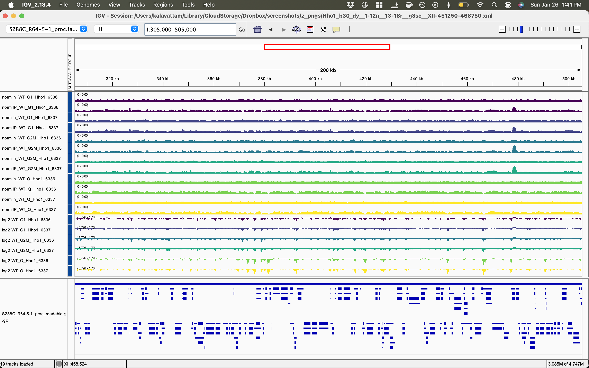
Rows 1&ndash;12: Hho1 normalized coverage tracks (i.e., tracks that have been [length-and-unity-normalized](#combined-length-and-unity-normalization)) with group autoscaling across G1, G2M, and Q samples. Rows 13&ndash;18: $\log_{2}$ ratios of normalized coverage tracks with group autoscaling across G1, G2M, and Q samples. Final row: *S. cerevisiae* annotated genome features. Tracks are binned at 30-bp resolution. All division operations used [minimum input depth values](#g-construct-sample-tables-recording-computed-scaling-factors-for-normalization).

<a id="b-hho1-xii451250-468750-rdna-locus"></a>
##### b. Hho1, XII:451250-468750 (rDNA locus)
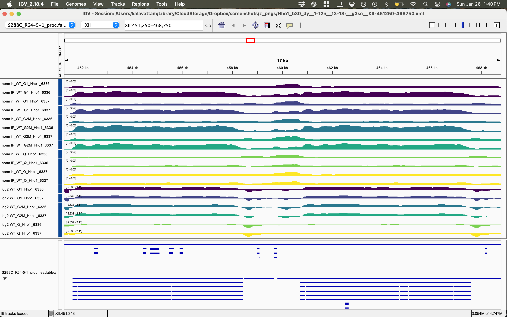
Rows 1&ndash;12: Hho1 normalized coverage tracks (i.e., tracks that have been [length-and-unity-normalized](#combined-length-and-unity-normalization)) with group autoscaling across G1, G2M, and Q samples. Rows 13&ndash;18: $\log_{2}$ ratios of normalized coverage tracks with group autoscaling across G1, G2M, and Q samples. Final row: *S. cerevisiae* annotated genome features. Tracks are binned at 30-bp resolution. All division operations used [minimum input depth values](#g-construct-sample-tables-recording-computed-scaling-factors-for-normalization).

<a id="3-hmo1-normalized-coverage-tracks"></a>
#### 3. Hmo1 normalized coverage tracks
<a id="a-hmo1-ii305000-505000"></a>
##### a. Hmo1, II:305000-505000
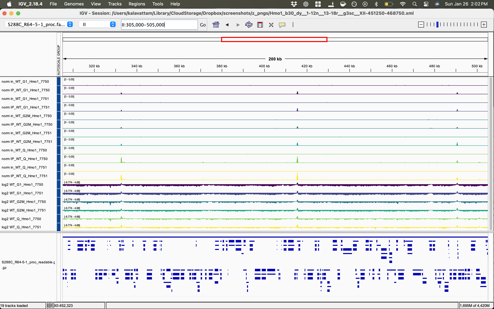
Rows 1&ndash;12: Hmo1 normalized coverage tracks (i.e., tracks that have been [length-and-unity-normalized](#combined-length-and-unity-normalization)) with group autoscaling across G1, G2M, and Q samples. Rows 13&ndash;18: $\log_{2}$ ratios of normalized coverage tracks with group autoscaling across G1, G2M, and Q samples. Final row: *S. cerevisiae* annotated genome features. Tracks are binned at 30-bp resolution. All division operations used [minimum input depth values](#g-construct-sample-tables-recording-computed-scaling-factors-for-normalization).

<a id="b-hmo1-xii451250-468750-rdna-locus"></a>
##### b. Hmo1, XII:451250-468750 (rDNA locus)
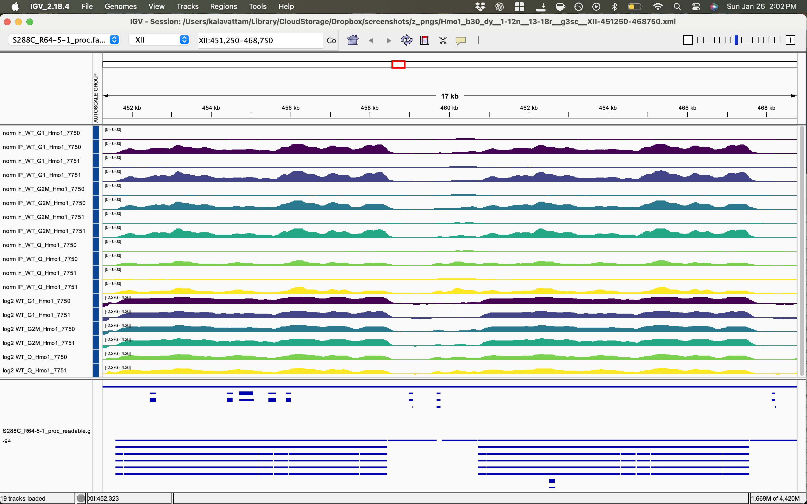
Rows 1&ndash;12: Hmo1 normalized coverage tracks (i.e., tracks that have been [length-and-unity-normalized](#combined-length-and-unity-normalization)) with group autoscaling across G1, G2M, and Q samples. Rows 13&ndash;18: $\log_{2}$ ratios of normalized coverage tracks with group autoscaling across G1, G2M, and Q samples. Final row: *S. cerevisiae* annotated genome features. Tracks are binned at 30-bp resolution. All division operations used [minimum input depth values](#g-construct-sample-tables-recording-computed-scaling-factors-for-normalization).

<a id="4-hho1-scaled-coverage-tracks"></a>
#### 4. Hho1 scaled coverage tracks
<a id="a-hho1-ii305000-505000-1"></a>
##### a. Hho1, II:305000-505000
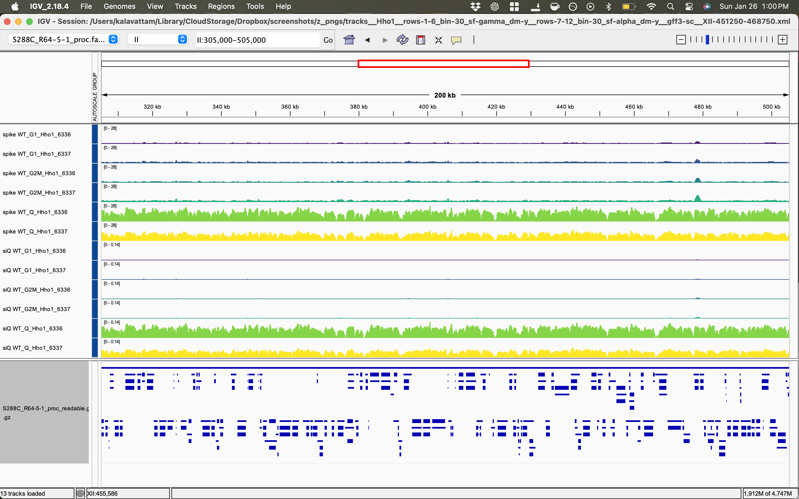
Rows 1&mdash;6: Hho1 coverage tracks scaled using spike-in normalization ($\gamma$) with group autoscaling across G1, G2M, and Q samples. Rows 7&mdash;12: Hho1 coverage tracks scaled using siQ-ChIP normalization ($\alpha$) with group autoscaling across G1, G2M, and Q samples. Final row: *S. cerevisiae* annotated genome features. Tracks are binned at 30-bp resolution. All division operations used [minimum input depth values](#g-construct-sample-tables-recording-computed-scaling-factors-for-normalization).

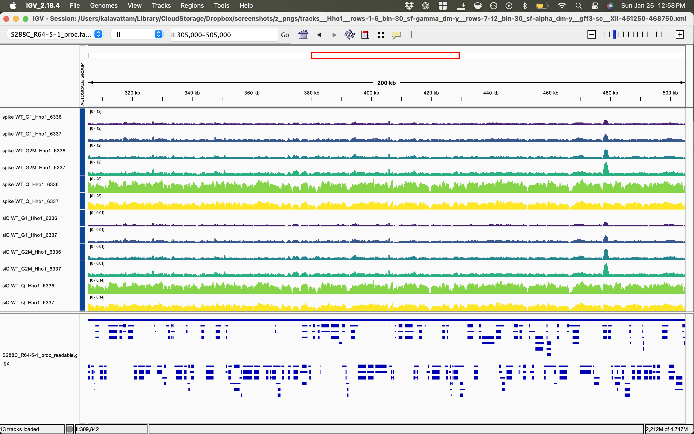
Rows 1&mdash;6: Hho1 coverage tracks scaled using spike-in normalization ($\gamma$) with G1 and G2M autoscaled separately from Q. Rows 7&mdash;12: Hho1 coverage tracks scaled using siQ-ChIP normalization ($\alpha$) with G1 and G2M autoscaled separately from Q. Final row: *S. cerevisiae* annotated genome features. Tracks are binned at 30-bp resolution. All division operations used [minimum input depth values](#g-construct-sample-tables-recording-computed-scaling-factors-for-normalization).

<a id="b-hho1-xii451250-468750-rdna-locus-1"></a>
##### b. Hho1, XII:451250-468750 (rDNA locus)
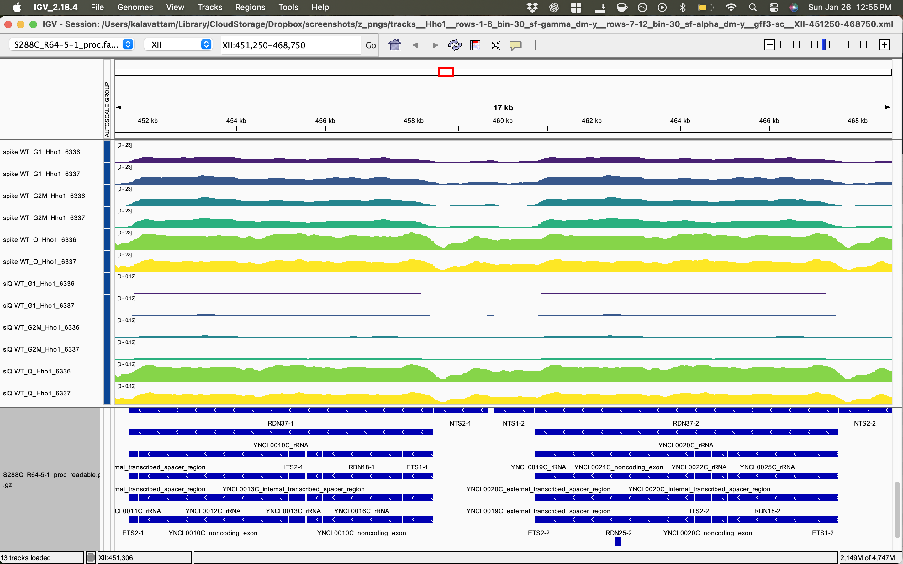
Rows 1&mdash;6: Hho1 coverage tracks scaled using spike-in normalization ($\gamma$) with group autoscaling across G1, G2M, and Q samples. Rows 7&mdash;12: Hho1 coverage tracks scaled using siQ-ChIP normalization ($\alpha$) with group autoscaling across G1, G2M, and Q samples. Final row: *S. cerevisiae* annotated genome features. Tracks are binned at 30-bp resolution. All division operations used [minimum input depth values](#g-construct-sample-tables-recording-computed-scaling-factors-for-normalization).

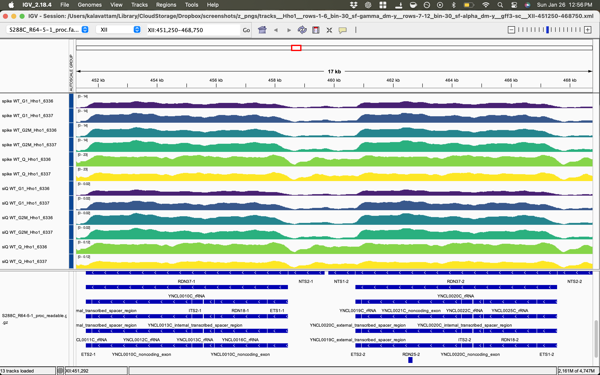
Rows 1&mdash;6: Hho1 coverage tracks scaled using spike-in normalization ($\gamma$) with G1 and G2M autoscaled separately from Q. Rows 7&mdash;12: Hho1 coverage tracks scaled using siQ-ChIP normalization ($\alpha$) with G1 and G2M autoscaled separately from Q. Final row: *S. cerevisiae* annotated genome features. Tracks are binned at 30-bp resolution. All division operations used [minimum input depth values](#g-construct-sample-tables-recording-computed-scaling-factors-for-normalization).

<a id="5-hmo1-scaled-coverage-tracks"></a>
#### 5. Hmo1 scaled coverage tracks
<a id="a-hmo1-ii305000-505000-1"></a>
##### a. Hmo1, II:305000-505000
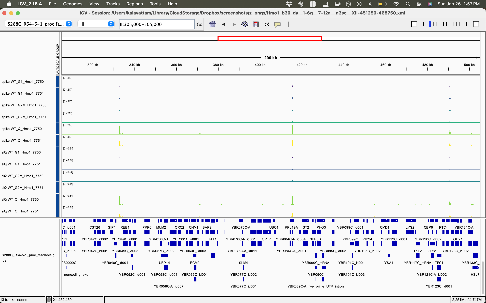
Rows 1&mdash;6: Hmo1 coverage tracks scaled using spike-in normalization ($\gamma$) with group autoscaling across G1, G2M, and Q samples. Rows 7&mdash;12: Hmo1 coverage tracks scaled using siQ-ChIP normalization ($\alpha$) with group autoscaling across G1, G2M, and Q samples. Final row: *S. cerevisiae* annotated genome features. Tracks are binned at 30-bp resolution. All division operations used [minimum input depth values](#g-construct-sample-tables-recording-computed-scaling-factors-for-normalization).

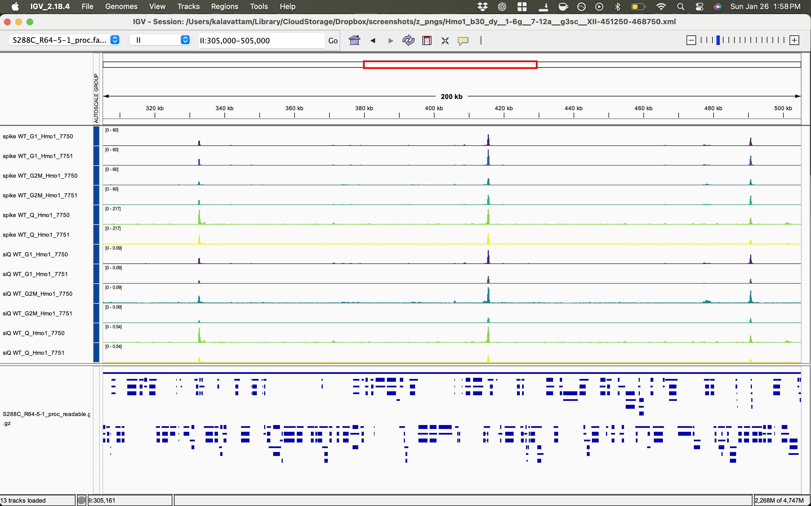
Rows 1&mdash;6: Hmo1 coverage tracks scaled using spike-in normalization ($\gamma$) with G1 and G2M autoscaled separately from Q. Rows 7&mdash;12: Hmo1 coverage tracks scaled using siQ-ChIP normalization ($\alpha$) with G1 and G2M autoscaled separately from Q. Final row: *S. cerevisiae* annotated genome features. Tracks are binned at 30-bp resolution. All division operations used [minimum input depth values](#g-construct-sample-tables-recording-computed-scaling-factors-for-normalization).

<a id="b-hmo1-xii451250-468750-rdna-locus-1"></a>
##### b. Hmo1, XII:451250-468750 (rDNA locus)

Rows 1&mdash;6: Hmo1 coverage tracks scaled using spike-in normalization ($\gamma$) with group autoscaling across G1, G2M, and Q samples. Rows 7&mdash;12: Hmo1 coverage tracks scaled using siQ-ChIP normalization ($\alpha$) with group autoscaling across G1, G2M, and Q samples. Final row: *S. cerevisiae* annotated genome features. Tracks are binned at 30-bp resolution. All division operations used [minimum input depth values](#g-construct-sample-tables-recording-computed-scaling-factors-for-normalization).

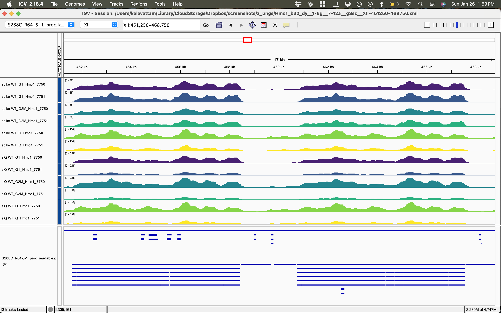
Rows 1&mdash;6: Hmo1 coverage tracks scaled using spike-in normalization ($\gamma$) with G1 and G2M autoscaled separately from Q. Rows 7&mdash;12: Hmo1 coverage tracks scaled using siQ-ChIP normalization ($\alpha$) with G1 and G2M autoscaled separately from Q. Final row: *S. cerevisiae* annotated genome features. Tracks are binned at 30-bp resolution. All division operations used [minimum input depth values](#g-construct-sample-tables-recording-computed-scaling-factors-for-normalization).
